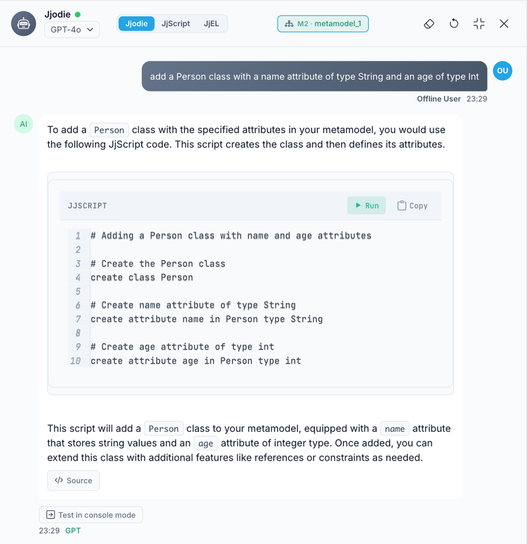
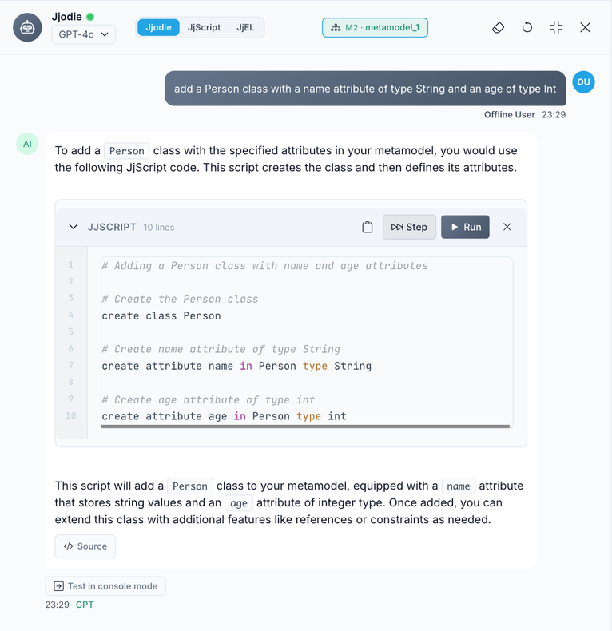
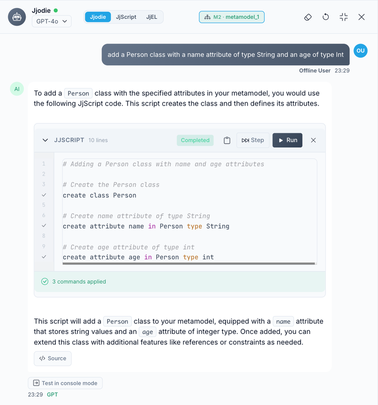
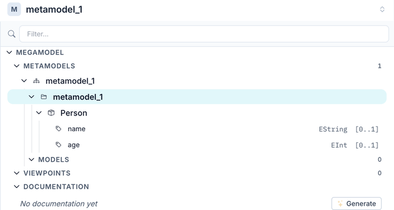

Jjodie is the conversational side of AI in Jjodel. It lives in the [Console](../../user-guide/console), in the mode named after it, and does two things: it answers questions about Model-Driven Engineering and about Jjodel, and it turns editing requests into [JjScript](../../languages/jjscript) that you run yourself.



## What Jjodie Knows

Jjodie is instructed to stay on metamodeling, Jjodel, and JjScript. Ask it what a containment reference is, how viewpoints relate to metamodels, or which JjScript command creates an enumeration, and it answers in that frame. It is not a general-purpose assistant.

With every message, Jjodie receives the artifact the Console is bound to, the one named in the context chip of the header (`M2 · metamodel_1`, for example). For a metamodel it gets the classes, features, and enumerations. For a model it gets the instances and a conformance report, so it can tell you why an instance violates its metaclass. When no artifact is in focus, it gets all the metamodels of the project. On top of that, a local index of the project supplies the fragments most relevant to your question. The index is computed in the browser and calls no external service.

## Generating Metamodels and Models

Editing requests come back as JjScript, never as direct changes. With the Console bound to `metamodel_1`, type:

```text title="Console (Jjodie mode)"
add a Person class with a name attribute of type String and an age of type Int
```

Jjodie answers with a sentence and a **JJSCRIPT** block, with **Run** and **Copy** in its header:

```jjscript title="Jjodie's answer"
# Create the Person class
create class Person

# Create name attribute of type String
create attribute name in Person type String

# Create age attribute of type int
create attribute age in Person type int
```

Pressing **Run** does not execute anything yet. It turns the block into a script panel: the line count, a copy button, **Step**, **Run**, and a cross to close it.



**Run** executes the whole script. **Step** executes one command at a time, which is the way to follow what a longer script does to your metamodel, and to stop before a command you do not want. As commands run, each line gets a check mark, the header turns to **Completed**, and a summary counts the commands applied.



The class is now in the metamodel, with `name` as `EString` and `age` as `EInt`. The tree view shows it at once, and so does the canvas:



The same flow builds models. With the Console bound to a model, a request such as "create two Person instances, Alice and Bob" comes back as the JjScript that instantiates the classes and sets their slots. Jjodie routes between the two levels from the context chip, so bind the Console to the right artifact before you ask.

If you type something that already parses as a JjScript command while in Jjodie mode, the Console does not send it to the model. It shows a card, **This looks like a JjScript command**, with **Run** and **Ask Jjodie**: run it as is, or send it to Jjodie as a question.

## Meta-Commands

Typed at the start of the input, without leaving the mode you are in:

- `/ask` switches to Jjodie mode; `/js` and `/jjel` switch to the JjScript and JjEL modes
- `/help` prints the list of commands
- `/clear` empties the transcript

A slash command Jjodie does not know is reported as such and not sent to the model.

## When Something Fails

A JjScript block that fails shows the error and an **Ask Jjodie** button that puts the failed script and the message into the input, so you can ask for a fix. A console expression that fails offers the same. If the provider selected for the chat has no key but another one does, Jjodie switches to it and says so in the transcript. If no provider is configured at all, the answer tells you to open Settings; see [Providers](../providers).

## Explain This

Right-click a class, attribute, reference, or instance on the canvas and choose **Explain this**. A window streams a short explanation of the element, written for someone learning MDE: what it is, what it holds, how it relates to the rest of the metamodel. The text is generated from the element's name, type, and properties; it is a reading aid, not documentation, and it is not saved. Streaming works with Claude, GPT, DeepSeek, Mistral, and Groq; the other providers report that streaming is not supported.

## Limits

- Answers are capped in length. A very long script may be cut; ask for it in parts.
- **Stop** in the chat stops the display, not the request in flight. The provider still completes and bills the call.
- Jjodie sees the artifact in focus and fragments of the rest of the project, not the whole project verbatim. For a question about a specific model, bind the Console to it first.
