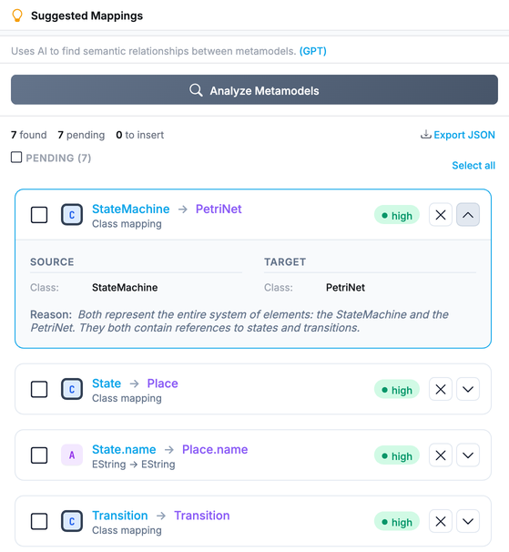

Writing a model-to-model transformation starts with a question: which class of the source corresponds to which class of the target, and which attributes carry over. The **Suggested Mappings** panel of the [transformation editor](../../user-guide/transformation-editor) asks that question to a language model, on the two metamodels of the transformation, and returns the answer as cards you can check and insert as [JjTL](../../languages/jjtl).

## Running an Analysis

Open a transformation whose source and target metamodels are both loaded, then press **Analyze Metamodels** in the panel. Both metamodels are flattened to text, classes with their attributes and references, and sent to the provider selected for this feature, with an instruction to find the semantic correspondences between them. A progress dialog reports the three steps: building the prompt, calling the model, parsing the answer.

The answer is a list of mappings. Each one names a source class, optionally a source attribute, the target class and attribute, a confidence level, and the reason for the match. When the model sees a type difference it may add a conversion hint, and when a mapping should apply only to some instances, a guard hint.

## Reading the Cards

Every mapping becomes a card, `source → target`, with a confidence pill (**high**, **med**, **low**). Expand a card for the source and target details side by side. Two extra pills tell you what the executor will do with a mapping whose two types differ: **auto-resolved** when one side is a reference to another class, resolved after all instances exist; **auto-converted** when both sides are primitives and the value will be coerced at execution time (number to string, boolean to integer, enumeration to literal).

Cards sit in two groups. **PENDING** holds what the model proposed; check a card to move it to **TO INSERT**, or remove it with the cross. **Select all** checks everything at once.

## Inserting into the Editor

**Insert N mappings into editor** generates the JjTL for the checked cards and hands it to the code editor. From there the text is yours: the generated rules are ordinary JjTL, so you edit, reorder, and complete them as you would rules written by hand. **Export JSON** saves the raw suggestions instead, for example to compare two runs.

## Without a Model

The panel also offers **Try simple matching instead**, a local matcher that pairs classes and attributes by name. It needs no provider, catches the obvious correspondences, and misses everything that requires understanding what the names mean. It is the fallback when an analysis fails, and a reasonable first pass on metamodels that share a vocabulary.

## Limits

- Both metamodels go to the provider in full. Check the [privacy notes](../providers#privacy) before analyzing a metamodel you cannot share.
- **Cancel** during an analysis closes the dialog; the request already sent still completes on the provider side.
- Suggestions are one-to-one, class and attribute. Mappings that need several source elements, or that depend on a computed value, are for you to write.
