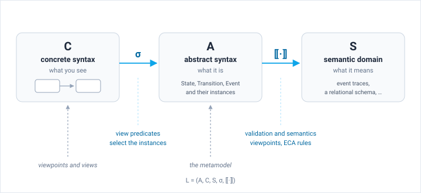

A modeling language is more than a set of symbols. It is a formal structure with well-defined components that connect what you see (notation) to what it means (semantics) through a precise mapping.

## Formal Definition

A language L consists of a tuple with five components:

**A** (Abstract Syntax): the set of valid models defined by a metamodel. The metamodel specifies metaclasses, attributes, references, and constraints. Every model that conforms to the metamodel belongs to A.

**C** (Concrete Syntax): the set of visual or textual representations. This is what you see on the screen or in a file: boxes, arrows, labels, indentation, keywords.

**S** (Semantic Domain): the space of meanings. For a state machine language, S might be a set of event traces; for an ER diagram, S might be a relational schema.

**σ** (Syntax Mapping): the function that maps concrete syntax to abstract syntax. Given a visual diagram C, σ produces the corresponding abstract model in A. In Jjodel, this mapping is defined by the predicates in each view: they select which model instances correspond to which visual representations.

**⟦·⟧** (Semantic Mapping): the function that interprets an abstract model into its meaning in S. This takes a model from A and produces its semantics.

In Jjodel, the abstract syntax is defined by the metamodel and the concrete syntax by viewpoints and their views. The syntax mapping σ is realized through view predicates, which select the instances a view applies to. What the view then draws is described declaratively, as a shape plus a structure and a form that Jjodel's interpreter renders. The JSX templates of 1.5 are no longer interpreted. The semantic mapping is expressed through validation and semantics viewpoints and their ECA rules.

## Metamodel as Abstract Syntax Provider

The metamodel defines the abstract syntax: the legal structures a model can have. It specifies which metaclasses exist, what attributes they carry, how they relate through references, and what constraints they must satisfy.

The meta-metamodel (M3 level) provides the building blocks for defining metamodels. In Jjodel, the meta-metamodel is the JjOM (Jjodel Object Model), which supplies constructs like DClass, DAttribute, DReference, and DEnumeration. See [JjOM Reference](../../reference/jjom) for the complete specification.

The relationship between levels:

**M3** (meta-metamodel / JjOM) defines the vocabulary: DClass, DAttribute, DReference. This is fixed.

**M2** (metamodel) uses M3 constructs to define a domain: Entity, Attribute, Relationship for an ER language. This is what you build in the metamodel editor.

**M1** (model) creates instances conforming to M2: a specific ER diagram with Customer, Order, Product. This is what you build in the model editor.

## Notation as Concrete Syntax Provider

A notation defines how abstract syntax elements appear visually. In Jjodel, each metamodel has an associated notation (e.g., "State Machine Notation"), and each notation contains viewpoints.

The notation architecture:

A **Notation** is associated with exactly one metamodel (via `definedBy`). It owns zero or more viewpoints.

A **Viewpoint** groups a family of views. Its type decides how it composes: a **Syntax** viewpoint is exclusive, so only one is active at a time, while **Decoration**, **Validation**, **Semantics**, and **Editor behavior** viewpoints are overlays that layer on top of it. The current build applies syntax viewpoints only; the overlay types are planned 3.5. See [Viewpoints](../../user-guide/viewpoints) for details.

A **View** targets instances of a specific metaclass through its predicate. It defines how those instances render, look, and behave. A view has a **kind**, which decides what it produces: a **vertex** draws a node on the canvas, an **edge** draws a connection, and a **row** draws a single value wherever it appears, inside a node, in a table cell, or in a form.

A **Node** is the concrete representation of an instance that satisfies a view's predicate. Nodes exist in the concrete syntax layer and carry layout and state information.

## Path from Domain to Language

Building a modeling language starts from the domain. The process follows a sequence:

**Domain analysis** identifies the relevant concepts, their properties, and relationships. See [Domain Analysis](../domain-analysis) for the methodology.

**Abstract syntax definition** encodes those concepts as a metamodel: metaclasses for domain concepts, attributes for properties, references for relationships.

**Concrete syntax definition** assigns visual forms to each metaclass through viewpoints and views. A DSL is a formal, machine-processable interface to domain knowledge; the concrete syntax is what makes that interface usable by humans.

**Validation** adds constraint checking through overlay viewpoints. These enforce rules that the metamodel syntax alone cannot express (e.g., "a state machine has exactly one initial state").

**Transformation** connects one language to another. A JjTL transformation reads models of one metamodel and produces models of a second one, which is how a language stops being an island. See [JjTL Reference](../../languages/jjtl).

The separation between abstract and concrete syntax is fundamental. The same abstract syntax can support multiple concrete syntaxes: a Chen-style ER notation and a crow's foot notation both render the same metamodel. Switching between them changes only the active viewpoint; the model data is unaffected.
