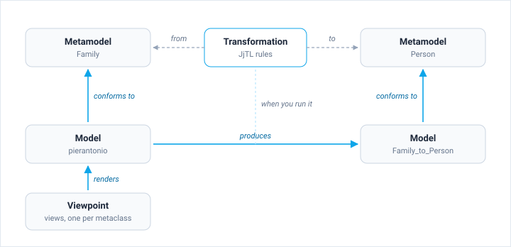
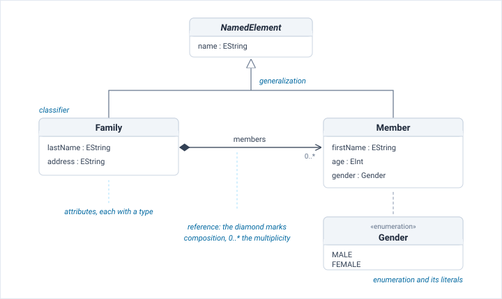
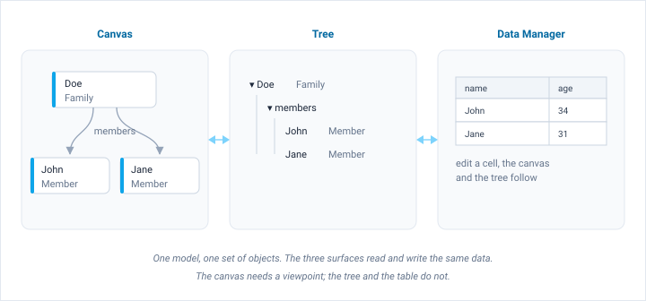
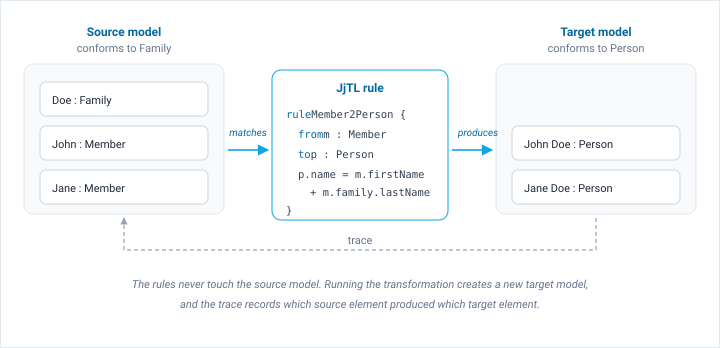
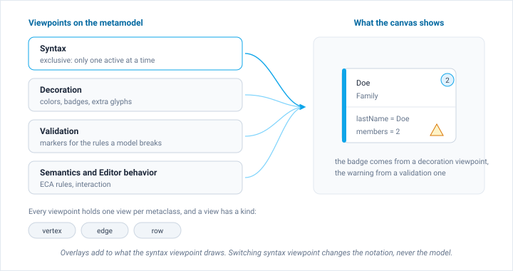

In Jjodel, a **project** is the top-level container that organizes all the resources needed to define, visualize, and work with your modeling languages. Understanding the project structure helps you manage complexity as your languages grow.

## Anatomy of a Project

Every Jjodel project follows a layered hierarchy:

```
Project
├── Metamodel(s)          — language definitions
│   ├── Package(s)        — logical groupings
│   │   ├── Class(es)     — element types
│   │   │   ├── Attributes
│   │   │   ├── References
│   │   │   └── Operations
│   │   └── ...
│   └── ...
├── Model(s)              — instances conforming to metamodels
│   └── Objects           — concrete elements with attribute values
├── Transformation(s)     — JjTL rules from one metamodel to another
└── Viewpoint(s)          — syntax, decoration, validation, and semantics
    └── Views             — per-metaclass rendering rules
```

The project page lists these four sections, and the tree in the right rail shows the same structure as one hierarchy, with the models nested under the metamodel they conform to.

The tree shows what contains what. The relations between the artifacts run differently:



A project also carries a **type** that decides who can reach it: **Private**, **Public**, or **Collaborative**. See [Dashboard](../../user-guide/dashboard) for how the type is set and how whole projects are imported and exported.

## Metamodels

A metamodel is the definition of a language. It declares which kinds of element a model may contain, what data each one carries, and how they may be connected. Everything you can express in a model comes from a decision taken here.



A metamodel is built out of four kinds of ingredient:

- **Classifiers** name the concepts of the domain. Each one becomes a type that model elements can instantiate. A classifier can be marked **Abstract**, which lets other classifiers inherit from it but forbids direct instances, or **Interface**, and it carries flags such as Final, Singleton, Rootable, and Partial that constrain how it is used.
- **Attributes** hold data. Each one has a primitive type from the Ecore set (EString, EInt, EFloat, EBoolean, EDate, and the others listed in [Basic Notions](../basic-notions)) and a multiplicity, so an attribute can hold a single value or a list.
- **References** connect classifiers. A reference has a target type, a multiplicity chosen from `[0..1]`, `[1..1]`, `[0..*]`, `[1..*]` or a custom range, and two flags that decide ownership: **Composition** means the source owns the target, so deleting the source deletes it, while **Aggregation** means the target is shared and survives on its own.
- **Generalizations** let a classifier inherit the attributes and references of another. Common features go in an abstract classifier and the specialized ones extend it.

**Enumerations** complete the picture with closed sets of literals, useful whenever an attribute may take only a handful of values.

Packages group classifiers into logical units inside a metamodel, which matters once a language grows past a screenful of classes. A project can hold several metamodels at once, which is what makes transformations between them possible.

Changing a metamodel has consequences downstream. Models already built against it are checked against the new definition, and views that target a removed classifier stop drawing anything. The [Metamodel Editor](../../user-guide/metamodel-editor) is where all of this is authored: classifiers dropped from the palette onto the canvas, features added to them, references drawn between anchors.

## Models

A model is a set of objects that conform to a metamodel. Each object is an instance of one classifier, each of its slots holds a value of the declared type, and each link between objects follows a reference declared in the metamodel. Conformance is not a one-off check at import time: Jjodel keeps it current while you edit, and the status bar at the bottom of the editor reports it along with the element counts.

Containment gives the model its shape. Composition references form a tree, and that tree is what the right rail shows and what determines what gets deleted with what. Non-containment references cut across the tree and are drawn as edges on the canvas.

The same model can be worked on through three surfaces, and they all write to the same objects:



The canvas renders the model through the active viewpoint, so it needs a notation before it shows anything. The tree ignores notation entirely and is the fastest way to find one element in a large model. The [Data Manager](../../user-guide/data-manager) shows instances of a chosen classifier as a table with a form beside it, which is the quickest way to enter a lot of data, and it works even for a metamodel that has no viewpoint yet.

A model enters a project in one of three ways: you create it empty and populate it, you import it, or a transformation produces it.

## Transformations

A transformation is a program that reads a model conforming to one metamodel and writes a model conforming to another. You declare it between a source and a target metamodel, then write in JjTL one **class mapping** for each correspondence between the two languages.



The header names the transformation and its two metamodels. Each mapping names a source class, an arrow, and a target class, and its body assigns the target features with `:=`:

```jjtl title="JjTL"
transformation Family2Person

from Family
to   Person

Member -> Person {
    name := self.name
    surname := self.parent.surname
}
```

Inside a mapping, `self` is the matched source element, so `self.parent.surname` walks the reference back to the family a member belongs to. A `where { ... }` guard restricts which instances a mapping accepts. Mappings do not run in a fixed order, and none of them modifies the source model: running the transformation creates a new target model, so you can fix a mapping and run it again without cleaning anything up first. See [JjTL Reference](../../languages/jjtl) for guards, multiplicities, and the expression sub-language.

Each produced element keeps a **trace** link back to the source element that caused it. The trace is what lets you answer "where did this come from" after the fact, and it is what makes mappings composable: a mapping that needs the target counterpart of a source element asks the trace for it instead of duplicating the work.

The [Transformation Editor](../../user-guide/transformation-editor) validates the code as you type and reports through two tabs: **Problems** for mappings that do not compile or refer to features the metamodels do not have, and **Output** for what happened during the last run.

JjTL is also the intermediate representation Jjodel uses internally, which is the ground for translating transformations to and from ATL and ETL in a future release.

## Viewpoints

A metamodel says what a model is; a viewpoint says how it looks. A viewpoint is a family of **views**, one per metaclass, each describing how instances of that metaclass are drawn.

The **type** you pick when you create a viewpoint decides how it composes with the others:



A **Syntax** viewpoint is exclusive. It provides the notation, so only one can be active at a time, and switching from one to another swaps the whole visual language while leaving the model untouched. **Decoration**, **Validation**, **Semantics**, and **Editor behavior** viewpoints are overlays: any number of them can be active together, and each adds to what the syntax viewpoint has already drawn. The current build applies syntax viewpoints only; the overlay types are planned <span class="badge-next">3.5</span>.

Inside a viewpoint, a view has two parts that matter. Its **predicate** selects the instances it applies to, which is usually all instances of one metaclass but can be narrower. Its **kind** decides what the view produces: a **vertex** draws a node on the canvas, an **edge** draws a connection between two nodes, and a **row** draws a single value wherever it appears, inside a node, in a table cell, or in a form.

Since 3.0 a view is described declaratively. You choose a shape and say where the name, the accent, and the feature rows go, and Jjodel's interpreter draws it. Views written as JSX templates in earlier versions keep working. See [Viewpoints](../../user-guide/viewpoints) for how viewpoints are created and combined, and [View Designer](../../user-guide/view-designer) for how one view is authored.

## Validation

Validation rules ensure model integrity beyond what the metamodel structure can express. They live in validation viewpoints, which the current build does not run yet <span class="badge-next">3.5</span>, and report through the editor: a warning triangle on the affected row in the tree, a marker on the node, and a message when you hover it.

## Feedback surfaces

Three places report what the tools are doing:

- The **status bar** at the bottom of an editor, with the element counts and the conformance state of the model
- The **Problems** and **Output** tabs of the Transformation Editor, for validation errors and execution details
- The [Console](../../user-guide/console), where JjScript and JjEL run and Jjodie answers

:::tip[One project, many perspectives]
A single project can contain multiple metamodels, multiple models, and multiple viewpoints. This modular structure lets you start simple and scale as your language and domain grow in complexity.
:::
