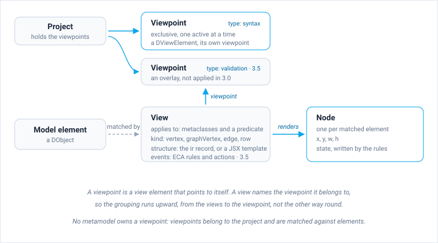
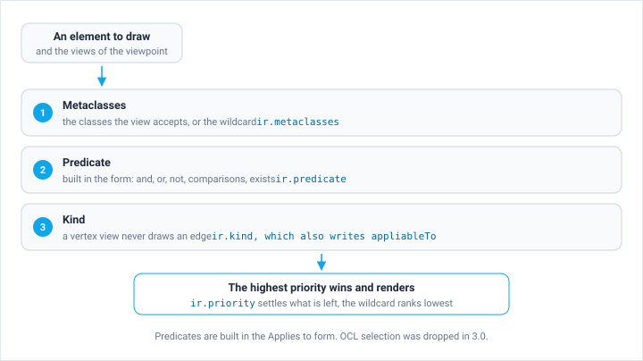

The Jjodel Object Model (JjOM) is the reflective runtime representation of all modeling artifacts within Jjodel. It is a formal and runtime representation of the elements that make up a model, including their types, relationships, and values. The JjOM is structured according to the metamodel defined by the user, is JSON-serializable, and can be inspected and edited at runtime.

The JjOM serves as the semantic backbone of any model and is the unifying substrate across all viewpoints. Jjodel interprets it for rendering views, applying validation rules, and driving simulation logic.

## Three Submodels: Data, Node, View

The JjOM organizes data across three interconnected submodels:

| Submodel | Purpose | Examples |
|----------|---------|----------|
| **Data** | Represents core modeling artifacts (classes, attributes, references, instances) | DClass, DObject, DAttribute, DReference |
| **Node** | Manages layout and positional data | Coordinates, geometry, visual state |
| **View** | Defines visual syntax and rendering | DViewPoint, DViewElement, predicates, ir records |

**Data** encodes the abstract syntax of a model: the elements, their attribute values, and their references. This is the semantic content of your model. When you create an Entity with attributes in an ER diagram, the data submodel stores those elements and their properties.

**Node** encodes all layout information: position, dimensions, edge routing, and visual state. This is the presentation layer. When you drag an element on the canvas, only the node submodel changes; the data remains untouched.

**View** defines how model elements are rendered visually. It holds the predicates that select elements and the declarations that draw them, which is what maps abstract syntax to concrete syntax. The active viewpoints decide which of these declarations apply, and so what the user sees on the canvas.

The separation of data, node, and view is architecturally significant. It enables layout-sensitive notations where the spatial position of elements contributes to meaning (e.g., railway track plans, PCB layouts), while keeping the semantic content independent of any specific visual arrangement. In Jjodel, layout is not decoration; it is a first-class dimension of meaning that can carry semantic weight.

## Architectural Context

The JjOM sits at the center of Jjodel's architecture, connecting the front-end and back-end:

- **Front-end**: React 18 and TypeScript, with Redux as the object store and Vite as the bundler
- **Back-end**: a .NET service that persists projects and serves them back
- **Object store**: the single store every editor reads and writes, which is what keeps the canvas, the tree, and the tables on the same data

The JjOM provides a unified API to query, edit, and synchronize models, their layout, and their visual representation. An analogy from the web domain: the JjOM plays a role similar to the Document Object Model (DOM), but for modeling artifacts instead of HTML documents.


## Viewpoints and Views

A metamodel says what a model is. A **viewpoint** says how it draws. Viewpoints belong to the project: the project holds them, and any of them can be matched against the elements of any model it contains. No metamodel owns a viewpoint, and there is no separate notation object between the two. The word notation is the conceptual term for what a viewpoint provides, and [Anatomy of a Modeling Language](../../concepts/modeling-language-anatomy) uses it in that sense.



A viewpoint is itself a view element: `DViewPoint` extends `DViewElement` and points to itself as its own viewpoint. Views name the viewpoint they belong to through their `viewpoint` field, so the grouping is read upward, from the views to the viewpoint, rather than as a list held by the viewpoint.

The **type** of a viewpoint decides how it composes with the others. It is one of `syntax`, `decoration`, `validation`, `semantics`, and `editor_behavior`. A syntax viewpoint is exclusive, so one is active at a time; the others are overlays and any number of them can be active together. The current build applies syntax viewpoints only: the other four types are declared and stored, but nothing renders them yet, and they are planned <span class="badge-next">3.5</span>. Viewpoints created before the type existed carry none, and their type is derived from the older flags: `isValidation` gives validation, `isExclusiveView` gives syntax, and anything else falls back to decoration. That derivation is why an imported viewpoint can behave differently from what its name suggests. See [Viewpoints](../../user-guide/viewpoints) for how they are created and combined.

A view has four parts. Its **applicability** says which elements it accepts: the metaclasses it targets, `ir.metaclasses`, plus an optional **predicate**, `ir.predicate`. The predicate is built in the **Applies to** form and stored as a structure, not as code: `and`, `or` and `not` over comparisons (`eq`, `neq`, `lt`, `lte`, `gt`, `gte`), `exists` and `empty` on a feature path, and `isKind` on a class. OCL selection was dropped in 3.0, and `oclCondition` survives only as a field of the older record. Its **kind** decides what it produces, a vertex, a graph vertex, an edge, or a row; the kind lives in `ir.kind`, which is also the single writer of `appliableTo`. Its **structure** says what the element draws, as fields of the `ir` record edited in the [View Designer](../../user-guide/view-designer). A view authored before 3.0 carries a `jsxString` template instead, which Jjodel no longer interprets. Its **events** hold the ECA rules and the custom actions, documented in [Jjodel Events](../jjodel-events); rules are being restored and are planned <span class="badge-next">3.5</span>.

The predicate is where the syntactic mapping of the language is realized. Given a model and a set of views, the predicates decide which elements get which visual form, which is the mapping written as σ in [Anatomy of a Modeling Language](../../concepts/modeling-language-anatomy). Each element a view accepts becomes a **node**, and the node carries the layout and the state that rules write.

### How a view is chosen

Several views can accept the same element, and they are filtered in order:



The metaclasses come first, `ir.metaclasses`, either a list of names or the wildcard `*`, which is the lowest specificity a view can declare. The predicate follows, evaluated on the element itself. The kind is structural: a view that produces a vertex never draws an edge, and `ir.kind` is what decides it. What is left is settled by `ir.priority`, and the highest one renders.

The older record carries a second set of fields that did the same job before 3.0: `appliableToClasses` as a match by JjOM class, `oclCondition` as an OCL selector, `subViews` as a boost given by a container to the views of what it holds, and `explicitApplicationPriority` as the tie-break. Views authored today do not use them, and sub-views are not applied in the current build <span class="badge-next">3.5</span>.

### What a view reads

A view reads the model through paths over the features of the element it draws. A path names a feature, and takes either its single value or the whole slot, so `name` reaches the name of the element and `ownedTransitions` reaches the objects the reference points to. The same paths appear in three places: in the predicate that selects the element, in the labels the view prints, and in the rules that react to a change.

Outside a view, in the [Console](../../user-guide/console) and in event handlers, the same navigation is written in JavaScript with the `$` prefix:

```javascript title="Navigating the same reference from the Console"
data.$ownedTransitions.values
    .filter(t => t.instanceof.name === 'Transition')
    .map(t => t.$name.value)
```

## Core Modeling Constructs

These are the meta-elements of the Jjodel meta-metamodel. Each one exists twice: as a **D** record, the serializable data kept in the store, and as an **L** wrapper, which is what expressions read. The properties below are the ones the L wrapper exposes, in the short form; the [JjOM API](../jjom-api) lists them in full.

| Construct | What it is | Properties that carry the weight |
|-----------|------------|----------------------------------|
| **DModel** | A metamodel, or a model | `isMetamodel` tells the two apart, `packages` holds the classifiers of a metamodel, `objects` the roots of a model, `instanceof` points from a model to its metamodel |
| **DPackage** | A namespace inside a metamodel | `classes`, `enumerators`, `datatypes`, `subpackages` |
| **DClass** | A classifier | `attributes`, `references` and `operations`, which `features` returns together; `extends` and `extendedBy` for inheritance, `implements` and `implementedBy` for interfaces, `referencedBy` for the references that point at it; `instances` and `allInstances` |
| **DAttribute** | A slot that holds data | `type` is the primitive classifier or the enumeration, `lowerBound` and `upperBound` the multiplicity, `ordered` and `unique` the semantics of a multi-valued slot, `defaultValue` what an instance starts with |
| **DReference** | A link between two classifiers | `type` is the class at the other end, `opposite` the reference that closes the pair, `containment`, `composition` and `aggregation` say who owns what |
| **DEnumerator** | A closed set of values | `literals`, each a `DEnumLiteral` with a `name` and a `value` |
| **DOperation** | A behavioral feature of a class | declared on the class, not executed by the editor |
| **DObject** | An instance of a class | `instanceof` gives the class, `features` the slots, `father` and `parent` the place in the containment tree, `allSubObjects` everything below it, `name` the display name |
| **DValue** | One slot of an object | `value` for the single value, `values` for the whole list, `instanceof` for the attribute or reference the slot fills |

Three points are worth stating rather than tabulating.

A **DClass** carries flags that constrain instantiation, and they are not interchangeable: `abstract` forbids direct instances, `interface` marks the class as an interface, `isSingleton` allows one instance, `isFinal` forbids subclassing, `isRootable` lets instances sit at the root of a model, `partial` lets instances carry features the class does not declare, and `isPrimitive` marks the built-in datatypes.

A **DReference** says who owns what through three flags. `containment` puts the target inside the source in the containment tree, `composition` means the source owns the target and deletes it with itself, `aggregation` means the target is shared and outlives the source. A contained element belongs to one parent only, which is why new instances of a contained type are created from the context menu of their parent.

On a **DObject**, `className` is not the metaclass: it names the kind of JjOM element you hold, `"DObject"` here and `"DClass"` for a classifier. The metaclass is `instanceof.name`. An ERD makes the distinction concrete: the Entity metaclass is a DClass, the entity "User" is a DObject, and its `id` attribute is a DAttribute whose slot on "User" is a DValue.

## Primitive Data Types

Jjodel provides the following primitive types, inherited from the Ecore type system:

| Type | Description | Example |
|------|-------------|---------|
| `EString` | A sequence of characters | `"Cardiology"` |
| `EInt` | 32-bit integer | `42` |
| `EBoolean` | True or false | `true` |
| `EDouble` | 64-bit floating point | `3.14159` |
| `EFloat` | 32-bit floating point | `2.71` |
| `ELong` | 64-bit integer | `123456789L` |
| `EShort` | 16-bit integer | `32767` |
| `EByte` | 8-bit integer | `127` |
| `EChar` | A single character | `'A'` |
| `EDate` | Date and time | `2025-06-20T10:00` |

In practice, `EString`, `EInt`, `EBoolean`, and `EDouble` cover the vast majority of use cases. The full set is available for interoperability with Ecore-based metamodels and for domains that require precise numeric types.

## The $ Prefix Convention

Built-in JjOM properties are read directly. The features your metamodel declares are read with a `$` prefix, which keeps them apart from the built-ins whatever you decide to call them.

Take a metamodel where `Entity` declares an attribute `name`, an attribute `description`, and a containment reference `ownedAttributes`:

```javascript title="Built-in properties and declared features"
// built-in
data.className              // "DObject" for an instance, "DClass" for a classifier
data.instanceof.name        // "Entity", the metaclass
data.id                     // the element id

// declared attribute
data.$name                  // the slot, a DValue
data.$name.value            // "User", the string in the slot
data.$description.value     // the description text

// declared reference
data.$ownedAttributes        // the slot
data.$ownedAttributes.values // the objects it points to

// is the reference set?
data.$left && data.$left.value
```

### The Special `name` Attribute

An attribute called `name` becomes the display name of the instance: `data.name` returns the same string as `data.$name.value`. That is why renaming an element on the canvas writes into the attribute rather than into some separate label.

An enumeration slot holds a literal. Read it as any other value:

```javascript title="Reading an enumeration"
data.$cardinality.value       // the literal
data.$cardinality.value.name  // "OneToMany"
```

## Navigating the JjOM

Expressions work with three variables, one per submodel: `data` for the model element, `node` for its layout and state, `view` for the view itself. Most of what you write touches `data`.

```javascript title="Reading a model"
// the name of the current element
data.$name.value

// every attribute of an Entity, with its type
data.$ownedAttributes.values.map(a => a.$name.value + ': ' + a.$type.value.name)

// only the attributes that hold text
data.$ownedAttributes.values
  .filter(a => a.$type.value.name === 'EString')
  .map(a => a.$name.value)
```

What you can navigate depends on your metamodel. A reference `left` from `Relation` to `Entity` gives `data.$left`; the JjOM mirrors the metamodel at runtime, so the vocabulary of your language is the vocabulary of these expressions.

## Layout-Sensitive Notation

Most visual notations in software engineering are **topological**: meaning is encoded in connectivity (which elements are connected by edges). In these notations, layout is irrelevant; you can move, resize, and rearrange elements without changing the model's meaning. ER diagrams and UML class diagrams are topological.

Some engineering domains use **layout-sensitive** notations: railway track plans, power cabinet schematics, PCB layouts, algebraic formulas. In these notations, the spatial order of elements changes their meaning. The expression `5 - 3` and `3 - 5` have the same topology (a subtraction with two operands) but opposite semantics determined by the left-right position of the operands.

Mainstream modeling tools (GMF, Sirius) treat layout as decoration, storing it in diagram files that are ignored semantically. This creates semantic ambiguity: two visually different diagrams may share the same abstract syntax even when their layout encodes different meanings.

Jjodel solves this by making layout a first-class semantic submodel. The node submodel captures positional information that viewpoint rules can read and react to, ensuring that each distinct layout maps to a unique abstract model. No layout data pollutes the metamodel; the node submodel handles it transparently.

| Tool | Layout treated as | Semantic Impact | Live Co-evolution |
|------|-------------------|-----------------|-------------------|
| GMF | rendering | ignored | no |
| Sirius | decorative | partial | limited |
| Jjodel | semantic submodel | preserved | yes |

## State Attributes

In Jjodel, every JjOM node (data, node, view) can carry a set of **computed states** that depend on the structure of the model and on other states. This mechanism is analogous to synthesized and inherited attributes in classical attribute grammars: synthesized attributes flow upward from children to parents, and inherited attributes flow downward from parents to children.

State attributes serve two purposes. On the abstract syntax side, they capture semantic or derived information: computed values, validity flags, types, derived names. On the concrete syntax side, they describe how the model should appear or behave in the editor: layout values, visibility, styling, or interactive state.

The Jjodel runtime evaluates state dependencies incrementally. When the model changes, all affected states update automatically, keeping views consistent without manual intervention.

## The D level and the L level

Every JjOM element exists twice. The **D** record is plain serializable data: fields and pointers, the form the store keeps and the server persists. The **L** wrapper is a proxy over that record, and it is what you get in templates, in expressions, and in the Console. The wrapper resolves a pointer into the object it names, computes derived properties such as `allInstances` or `extendedBy`, and validates a write before it reaches the store.

The practical consequence: read `instanceof` on an L object and you get the class, read it on the D record and you get its id. Write through the L wrapper and the change lands in the undo history and reaches every view; write into the D record and nothing notices.

`LModel` is the wrapper for a model. It finds elements by name and writes attribute values through the `$attr.value` pattern, which is the same convention templates use.

:::note
The JjOM is the single source of truth for all modeling data in Jjodel. Every editor, viewpoint, and validation rule operates on the same JjOM instance, ensuring consistency across all perspectives.
:::
