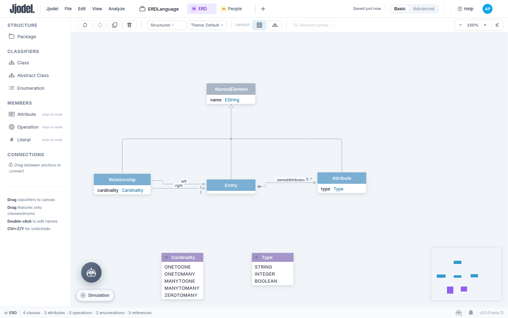
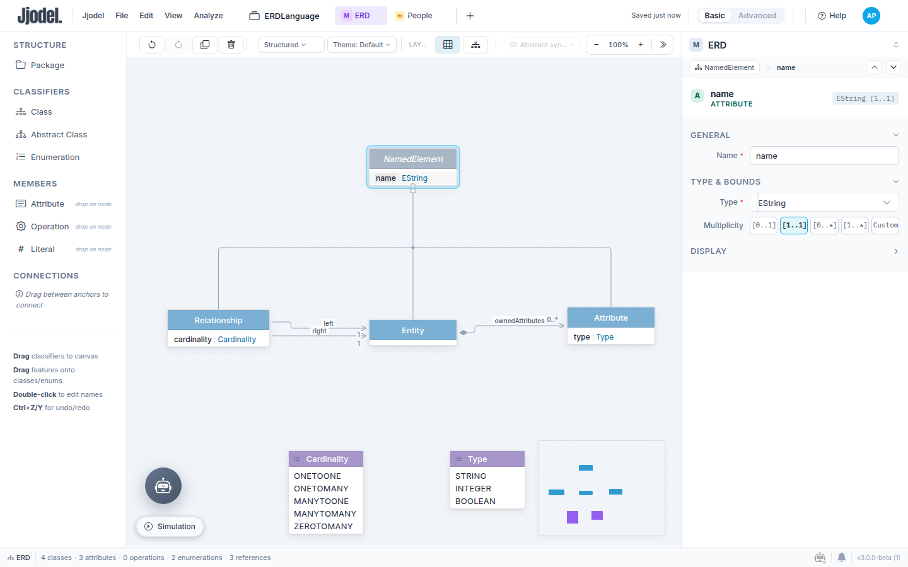
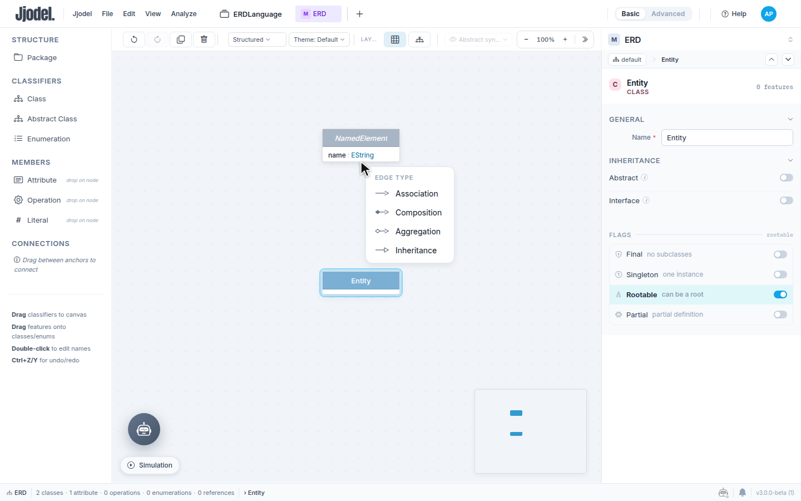
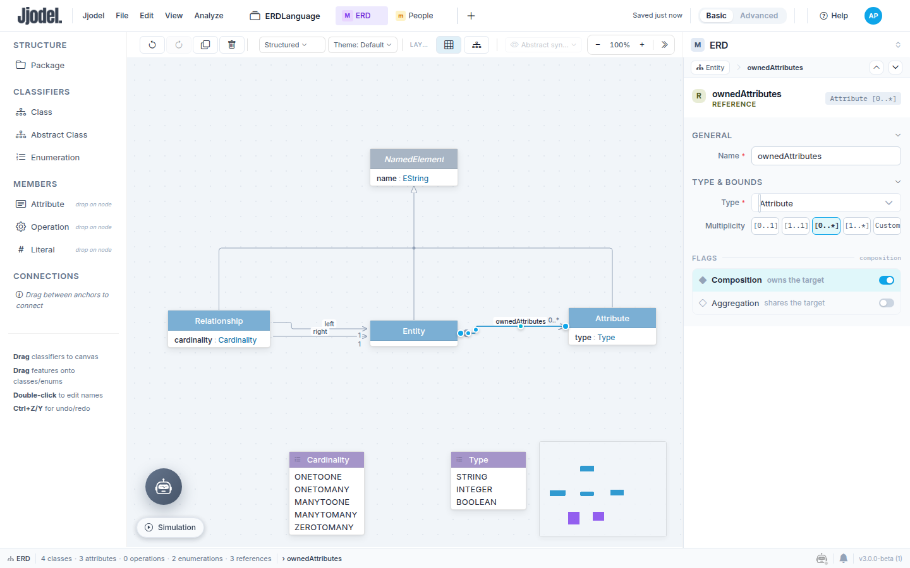
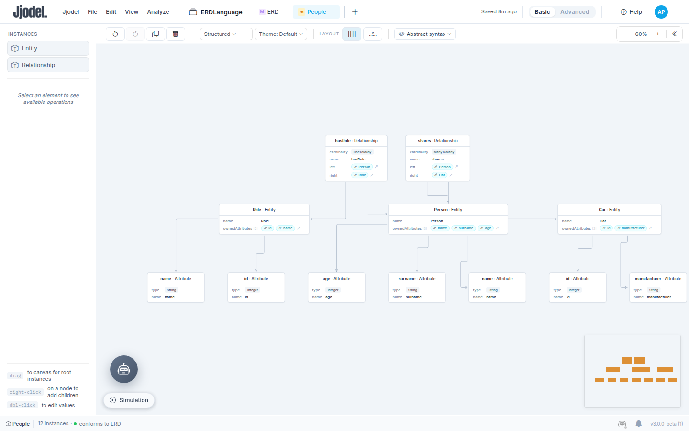
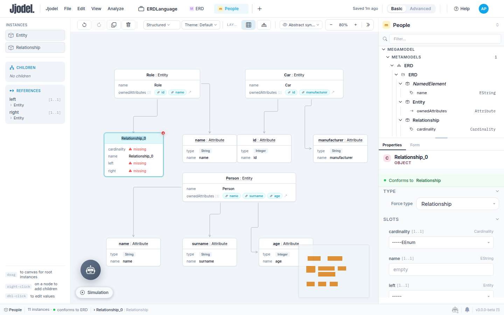

In this tutorial you define the abstract syntax of an Entity-Relationship language: entities that own typed attributes, relationships between entities, and cardinalities. You then build a small model with it and change the metamodel while the model is open, to see how Jjodel keeps the two in sync. No concrete syntax yet: the model is edited in the default view, so this page teaches one thing, the metamodel.

<video controls preload="metadata" width="100%" poster="/videos/tutorial-01-er-metamodel-poster.jpg" src="/videos/tutorial-01-er-metamodel.mp4">
  Your browser does not support the video element. <a href="/videos/tutorial-01-er-metamodel.mp4">Download the video</a>.
</video>

The video (under three minutes) shows the seven metamodel steps of Part 1 at speed. Use it as a preview, then follow the text.

**Prerequisites:** [Your First Project](../../getting-started/first-project) and [Basic Notions](../../concepts/basic-notions). The steps below use the **Basic** mode of the interface (the switch is in the top bar).

**Time:** about 30 minutes.

## Why ER diagrams

ER diagrams are a notation you know from database courses. The domain is familiar, so you can concentrate on the metamodeling mechanics: inheritance, containment, enumerations, mandatory features. The same notation carries the whole tutorial path: in the next tutorials it gets a graphical syntax, a data entry table, and a transformation to a relational schema.

One point is worth keeping in mind. ER diagrams are not a domain; they are a notation used to model other domains (a library, a hospital, a shop). Here the notation itself is what you formalize: Entity, Attribute and Relationship are the concepts you classify. In most real projects you build a language for a domain, not for a notation, and [Domain Analysis](../../concepts/domain-analysis) describes that process.

## Part 1: The metamodel

### Step 1: Create the project

1. Sign in to [app.jjodel.io](https://app.jjodel.io).
2. In the Dashboard, click **New Project**, name it `ERDLanguage`, keep it **Private**, and click **Create Project**.
3. Open the project and click **Create Your First Metamodel** (or **+ New** in the Metamodels section). The Metamodel Editor opens with an empty canvas, the palette on the left, and the tree and properties panel on the right.
4. The metamodel is called `metamodel_1`. Select it in the tree and change **Name** to `ERD` in the properties panel.

If the palette or the properties panel look unfamiliar, the [Metamodel Editor](../../user-guide/metamodel-editor) page describes each area.

### Step 2: Define NamedElement

Entities, attributes and relationships all have a name. Instead of repeating the attribute three times, define it once in an abstract superclass.

1. Drag **Abstract Class** from the palette onto the canvas. It appears as `NewAbstractClass`, already selected; type `NamedElement` in the **Name** field of the properties panel.
2. Drag **Attribute** from the **Members** section and drop it on the class. A row `attr_0 : EString` appears inside the box.
3. Click the row to select the attribute. Rename it `name`, keep the type `EString`, and click `[1..1]` under **Multiplicity**. The attribute is now mandatory: every named element must have a name.

Abstract means the class is never instantiated directly. It exists to be inherited from, and its name is shown in italics on the canvas.

### Step 3: Define Entity

1. Drag **Class** onto the canvas and name it `Entity`.
2. Move the pointer to the top edge of the `Entity` box: a small anchor appears. Drag from the anchor to the bottom edge of `NamedElement` and release on the anchor that appears there.
3. An **Edge type** menu opens with four choices: Association, Composition, Aggregation, Inheritance. Choose **Inheritance**.

`Entity` now inherits `name`. The class box shows no attribute of its own, but the tree view lists the inherited feature.

### Step 4: Define Attribute and its containment

1. Drag **Class** onto the canvas, name it `Attribute`, and connect it to `NamedElement` with **Inheritance**, as you did for `Entity`.
2. Connect `Entity` to `Attribute` the same way, but this time choose **Composition** in the Edge type menu. A reference `newComposition` with multiplicity `0..*` appears, drawn with a filled diamond on the `Entity` side.
3. Click the edge to select it, and rename it `ownedAttributes` in the properties panel. Leave the multiplicity at `[0..*]`.

Composition (containment) is the decision that matters here. It says that an Attribute belongs to exactly one Entity: the same Attribute instance cannot appear in two entities, and deleting an Entity deletes its attributes. It also changes how you create instances later: in a model, an Attribute can only be created from its parent Entity, never as a standalone element. Jjodel applies this immediately: the **Rootable** flag of `Attribute` switches off as soon as the class becomes the target of a composition.

### Step 5: Give attributes a type

Attributes need a type. Model the allowed types as a closed set.

1. Drag **Enumeration** onto the canvas and name it `Type`.
2. Drag **Literal** from **Members** onto the enumeration three times. Each drop adds a `literal_N` row; select each row and rename the literals `String`, `Integer`, `Boolean`.
3. Drop an **Attribute** on the `Attribute` class, name it `type`, and open the **Type** dropdown: after the primitives, it lists the enumerations of the metamodel. Choose `Type`, then set the multiplicity to `[1..1]`.

In a model, `type` will appear as a dropdown listing the three literals.

### Step 6: Define Relationship

1. Drag **Class** onto the canvas, name it `Relationship`, and connect it to `NamedElement` with **Inheritance**.
2. Connect `Relationship` to `Entity` and choose **Association**. Select the new edge, rename it `left`, set the multiplicity to `[1..1]`.
3. Repeat for a second association named `right`, also `[1..1]`. The two edges share the same anchors; select each one by clicking its line or its label.

These are plain references: a Relationship points at two entities but does not own them. The two entities keep living on their own, and the same Entity can take part in many relationships.

### Step 7: Define Cardinality

1. Drag **Enumeration** onto the canvas, name it `Cardinality`, and add the literals `OneToOne`, `OneToMany`, `ManyToOne`, `ManyToMany`.
2. Drop an **Attribute** on `Relationship`, name it `cardinality`, type `Cardinality`, multiplicity `[1..1]`.
3. Press **Ctrl+S** (or **File > Save Project**) to save. The top bar shows **Unsaved** while there are pending changes and **Saved just now** afterwards.

The metamodel is complete. The status bar at the bottom reports **4 classes, 3 attributes, 0 operations, 2 enumerations, 3 references**. It defines entities that own typed attributes (composition plus an enumeration) and relationships with a cardinality between two entities. If the boxes ended up scattered, **Auto layout** in the toolbar rearranges them.

## Part 2: A first model

### Step 8: Create the model

In the project sidebar click **New model**. The model opens in the editor with `ERD` as its metamodel (the properties panel says **Conforms to ERD**). Rename it `People` in the **Name** field.

Look at the palette on the left: under **Instances** it lists only `Entity` and `Relationship`. `Attribute` is missing because it is contained: it cannot be a root element of the model, so the palette does not offer it.

### Step 9: Create three entities

1. Drag **Entity** from the palette onto the canvas. A node `Entity_0 : Entity` appears with a red dot in its corner: `name` is mandatory and still empty.
2. In the properties panel, under **Slots**, type `Person` in the `name` field. The dot turns green.
3. Right-click the `Person` node and choose **Add Attribute (ownedAttributes)**. A node `Attribute_0 : Attribute` appears next to it, connected to `Person`, with `type` marked as **missing**.
4. Select the new node, set `type` to `String` from the dropdown and `name` to `name`.

Repeat for the other attributes and entities:

`Person` with attributes `name` (String), `surname` (String), `age` (Integer).

`Role` with attributes `id` (Integer), `name` (String).

`Car` with attributes `id` (Integer), `manufacturer` (String).

Attributes can only be created through the context menu of an entity. The palette has no entry for them, and this is the containment rule from Step 4 at work. When the canvas gets crowded, **Auto layout** in the toolbar tidies it.

### Step 10: Create two relationships

Drag **Relationship** onto the canvas. The node shows `cardinality`, `left` and `right` marked as **missing**, and the red badge in its corner counts the violations. The three features are mandatory in the metamodel (`[1..1]`), and the editor reports the violation as soon as the instance exists.

Fill the slots in the properties panel. The `left` and `right` dropdowns list only entities, because that is the type you declared; `cardinality` lists the literals of the enumeration.

`hasRole`: `left` is `Person`, `right` is `Role`, `cardinality` is `OneToMany`.

`shares`: `left` is `Person`, `right` is `Car`, `cardinality` is `ManyToMany`.

The status bar now reads **12 instances, conforms to ERD**. Save with **Ctrl+S**.

### Step 11: Change the metamodel while the model is open

Switch to the `ERD` tab in the top bar. Drop a **Literal** on the `Cardinality` enumeration and name it `ZeroToMany`. Switch back to the `People` tab, select `hasRole` and open the `cardinality` dropdown: the new literal is there.

The same holds for any change. Add an attribute to a class and every instance of that class shows the new slot; make a feature mandatory and instances that leave it empty are flagged at once. The next tutorial uses this when it adds an `isKey` flag to `Attribute` with the model already populated.

This is live co-evolution. The model is checked against the metamodel as it is now, not against a copy taken when the model was created, and there is no regeneration step in between.

## What you learned

You built a metamodel with an abstract superclass and inheritance, used composition to express ownership, and used enumerations for closed sets of values. You created a model that conforms to it, saw mandatory features turn into validation errors, and changed the metamodel with the model open.

Two ideas from this tutorial carry through the whole path. Containment decides how instances are created, which the Data Manager tutorial relies on. And enumerations become dropdowns in every form, which is what makes data entry in later tutorials safe.

## Next steps

Continue with [Concrete Syntax for ER Diagrams](../tutorial-05-er-concrete-syntax), which gives this metamodel a Chen notation and a table-based notation. For the features you used here, see the [Metamodel Editor](../../user-guide/metamodel-editor) page and the [JjOM reference](../../reference/jjom).
