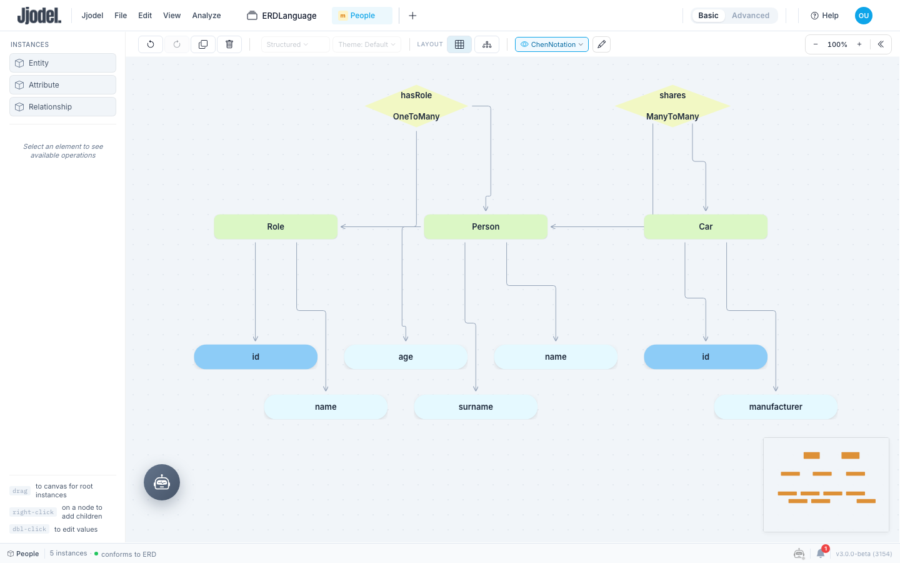
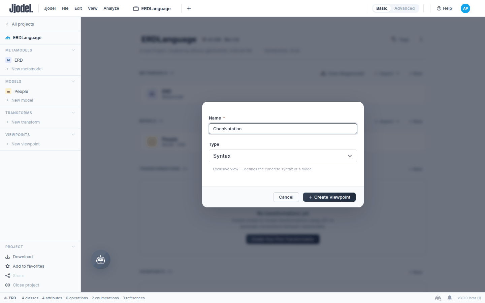
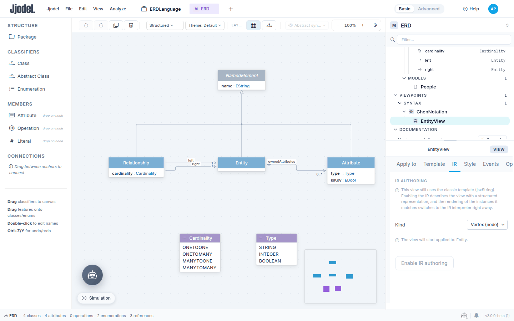
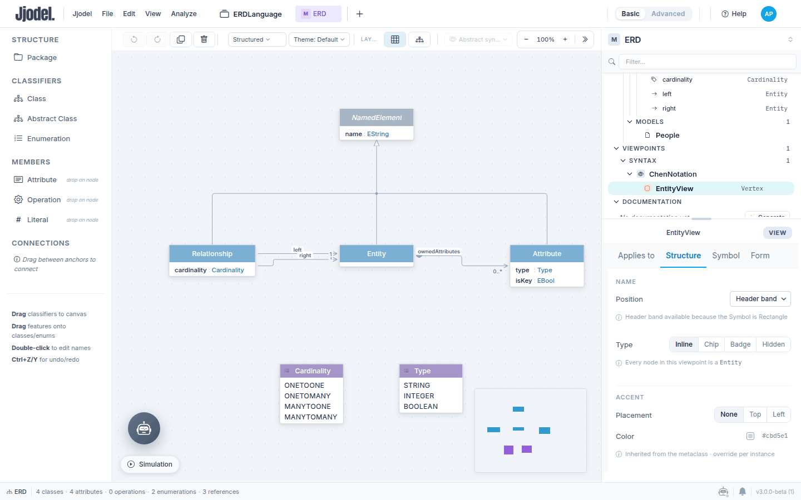
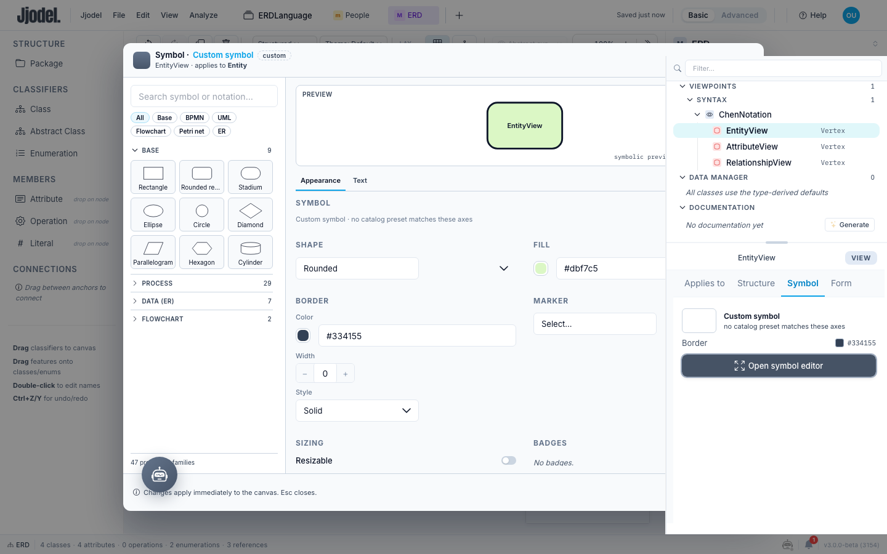
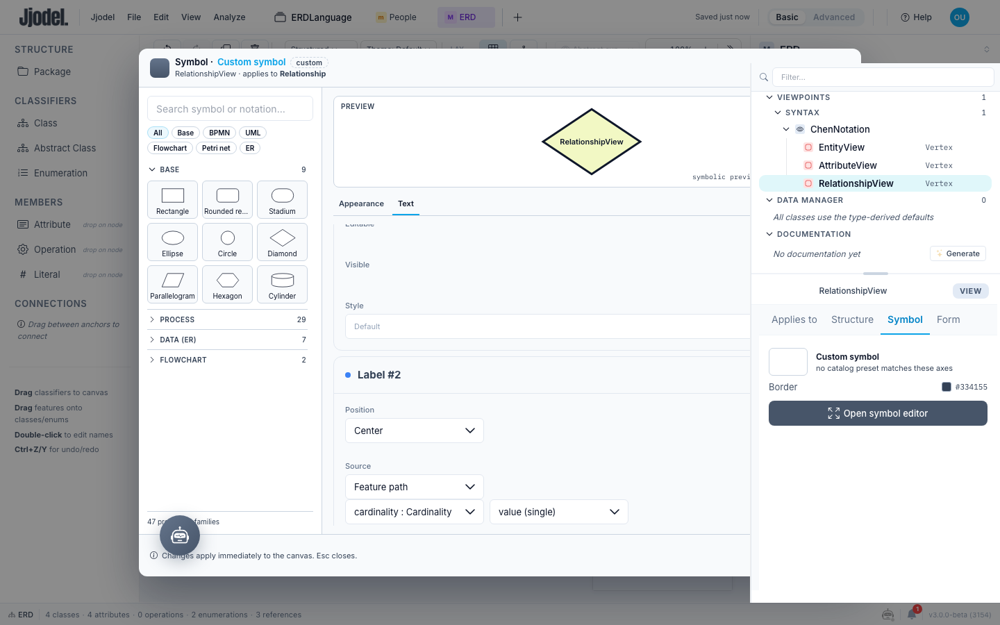
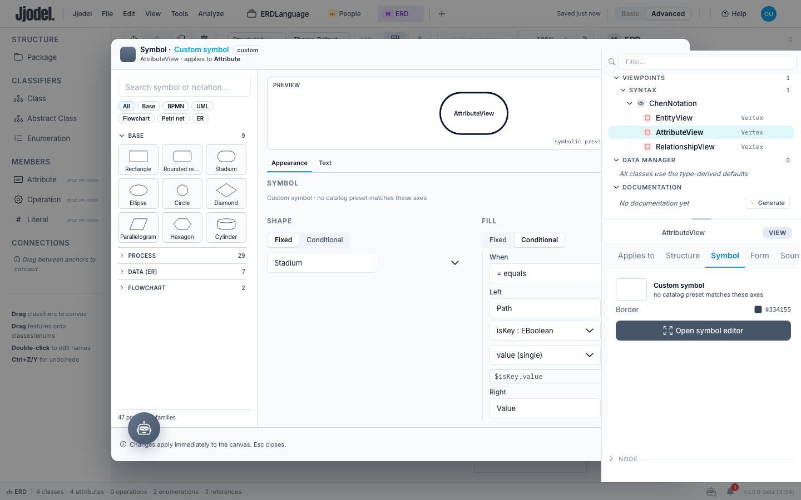

In this tutorial you give the ER language from [the first tutorial](../01-er-metamodel) a Chen-style notation: entities as rounded boxes, attributes as pills connected to their entity, relationships as diamonds that show their cardinality, key attributes filled in a deeper colour. Chen's textbook drawing uses plain rectangles, ovals and diamonds; the version here keeps the role of each shape and uses filled, borderless forms that read better on screen. You build it as a viewpoint with three views, one per metaclass, and you describe each view in the View Designer: which metaclass it applies to, which symbol draws it, which labels it shows. Jjodel renders the description; there is no template to write and no stylesheet to maintain.

<video controls preload="metadata" width="100%" poster="/videos/tutorial-02-chen-notation-poster.jpg" src="/videos/tutorial-02-chen-notation.mp4">
  Your browser does not support the video element. <a href="/videos/tutorial-02-chen-notation.mp4">Download the video</a>.
</video>

The video (under three minutes) shows Steps 1 to 7 at speed, recorded with the Data (ER) presets rather than the shapes and fills chosen below; the steps are the same. Use it as a preview, then follow the text; Step 8 is only in the text.

**Prerequisites:** [Your First Language: An ER Metamodel](../01-er-metamodel), with its `ERDLanguage` project, the `ERD` metamodel and the `People` model. Steps 1 to 7 work in **Basic** mode; Step 8 needs **Advanced**.

**Time:** about 40 minutes.

## Notation as a separate layer

The metamodel says what an ER model contains. A viewpoint says how it looks. A **syntax viewpoint** is exclusive: when it is active, its views decide the rendering of every instance they match, and metaclasses without a view fall back to the Default rendering. Building a second notation for the same models means adding a second viewpoint, not touching the metamodel or the models.

Each **view** is a record with three parts you will fill in turn. *Applies to*: the metaclass whose instances the view draws. *Symbol*: the shape, taken from a catalogue of presets, with its fill, border and text labels. *Structure*: what the node shows besides the symbol, in particular the compartment that lists attribute values. The [View Designer](../../user-guide/view-designer) page documents every field; this tutorial uses the few that Chen notation needs.

## Step 1: Create the viewpoint

1. Open the `ERDLanguage` project page and click **New viewpoint** in the sidebar (or **+ New** in the Viewpoints section).
2. Name it `ChenNotation`, keep the type **Syntax** (the dialog says: exclusive view, defines the concrete syntax of a model), and click **Create Viewpoint**.

The metamodel editor opens with the viewpoint selected in the properties panel, and the tree on the right gains a row under **Viewpoints > Syntax > ChenNotation**. The viewpoint is empty: it has no views yet.

## Step 2: The Entity view

1. In the tree, hover the `ChenNotation` row and click the **+** that appears at its right. A row `New view` opens for editing: type `EntityView` and press Enter, then click the row to select the view.
2. In the **Apply to** tab, open **Applicable to** and choose `ERD.Entity`.
3. Open the **IR** tab. It explains that the view still uses the classic template and offers to describe it with a structured record instead. Choose **Kind: Vertex (node)** and click **Enable IR authoring**.

The tabs of the panel change to **Applies to**, **Structure**, **Symbol** and **Form**: this is the View Designer. The Applies to tab now lists `Entity` under **Metaclasses**, with room for a predicate you do not need here.

## Step 3: Remove the compartment

Open the **Structure** tab. Under **Field compartments** there is one compartment, `attributes`, which lists the attribute values of the instance inside the node; that is what the Default rendering shows. Chen notation draws attributes as their own ovals, so click the trash icon of the compartment to remove it.

Do this before you change the symbol. Some symbols, the ellipse and the diamond among them, have no room for rows: on those the panel hides the compartment list, but a compartment that is still in the record keeps rendering. Removing it while the symbol is a rectangle avoids the detour.

## Step 4: Choose the symbol and its label

1. Open the **Symbol** tab and click **Open symbol editor**. The left column is a catalogue of presets grouped by family: Base, Process, Data (ER), Flowchart. In **Base**, click **Rounded rectangle**. The preview updates.
2. Stay in the **Appearance** tab. Under **Fill** type `#dbf7c5`; under **Border** set **Width** to `0`. The moment you change a value the header reads *Custom symbol*: the preset was a starting point, the record is yours.
3. Switch to the **Text** tab. Under **Labels**, set **Label #1** to **Position: Center** and **Source: Intrinsic property**, then pick `name` in the second dropdown.
4. Press Esc to close the editor.

The Data (ER) family has seven presets, Entity, Weak entity, Relationship, Identifying relationship, Attribute, Derived attribute, Multivalued attribute, with the textbook black borders already set. Pick those instead of the Base shapes if you want the classic look, or when your metamodel distinguishes weak entities or derived attributes.

## Step 5: Look at the model

Open the `People` model from the project page or its tab. In the toolbar, the viewpoint selector reads **Abstract syntax**: open it and choose **ChenNotation**.

Three things change. Entities render as green rounded boxes with their name in the middle. Attributes and relationships still show as small boxes, and the tree marks their metaclasses as **not rendered**: the viewpoint has no view for them yet, so they fall back. The palette on the left lists **Entity** under Instances and `Relationship` under **Not in this viewpoint**, because a viewpoint without a view for a metaclass gives you no way to create its instances.

The connections between entities and attributes are drawn without any work on your side. A reference whose source and target are both on the canvas becomes an edge, and `ownedAttributes`, `left` and `right` are references.

## Step 6: The Attribute view

Back in the `ERD` tab, add a second view to `ChenNotation` and name it `AttributeView`. Repeat the sequence of Steps 2 to 4 with three differences: **Applicable to** is `ERD.Attribute`, the preset is **Stadium** in the Base family, and the fill is `#e5f9ff`, again with border width `0`. Keep the order: enable IR authoring, remove the compartment in Structure, then pick the symbol, set fill and border, and set the centered `name` label.

Switch to the `People` tab: the attributes are now pale blue pills hanging from their entity.

## Step 7: The Relationship view

Add a third view, `RelationshipView`, applicable to `ERD.Relationship`, kind Vertex, compartment removed, preset **Diamond** in the Base family, fill `#f2f8c4`, border width `0`, Label #1 centered on `name`. Then give the diamond a second label for the cardinality:

1. In the **Text** tab of the symbol editor click **Add label**.
2. Set **Label #2** to **Position: Center** and **Source: Feature path**, and choose `cardinality : Cardinality` in the feature dropdown. Two centered labels stack: the name above, the cardinality under it.
3. Close the editor and press **Ctrl+S**.

In `People`, `hasRole` and `shares` are yellow diamonds with the relationship name and `OneToMany` or `ManyToMany` inside, each connected to its two entities. If the canvas is crowded, **Auto layout** in the toolbar rearranges it. The Relationship metaclass is back in the palette.

## Step 8: Highlight key attributes

Chen notation underlines key attributes. The metamodel has no notion of key yet, and the text styles of the symbol editor offer font, size, weight, italics and colour but no underline, so you will mark keys with a deeper fill instead. This step needs **Advanced** mode, where conditional fields are edited.

1. In the `ERD` metamodel, drop an **Attribute** on the `Attribute` class and name it `isKey`, type `EBoolean`. Every Attribute instance gains the feature at once, unset.
2. In `People`, select the `id` attribute of `Role`. In the properties panel the `isKey` slot reads **No values**: click its **+** and switch the toggle to **true**. Do the same for the `id` of `Car`.
3. Switch the top bar to **Advanced**. Select `AttributeView`, open the symbol editor, and in the **Appearance** tab set **Fill** to **Conditional**. Fill in the rule: **When** `= equals`; **Left**: `Path`, feature `isKey : EBoolean`; **Right**: `Value`, `Boolean`, toggle on; **Then**: `#8dccf7`; **Else** keeps the `#e5f9ff` of Step 6.
4. Close the editor and save.

The two `id` pills turn a deeper blue; the other attributes keep the pale fill. Toggle `isKey` on any attribute and its pill changes at once: the condition is evaluated on the instance, every time it renders.

The same **Fixed / Conditional** switch exists on the shape, the marker, the border and each text style, and the same rule editor appears wherever you choose Conditional. Whatever depends on the data of an instance is expressed this way.

## What you learned

A notation is a syntax viewpoint made of views, one per metaclass, and it lives beside the metamodel rather than inside it. A view is a record you fill in the View Designer: the metaclass it applies to, a symbol from the catalogue with its labels, and the structure of the node. References between instances on the canvas become edges on their own. Values of the instance can drive the rendering through conditional fields, without writing an expression language.

## Next steps

The next tutorial, [Populating a Model with the Data Manager](../03-data-manager), grows the `People` model from a table and shows the key attributes filled by the rule you just wrote. For the fields you used, see [View Designer](../../user-guide/view-designer); for how viewpoints compose and what exclusive means, see [Viewpoints](../../user-guide/viewpoints).
