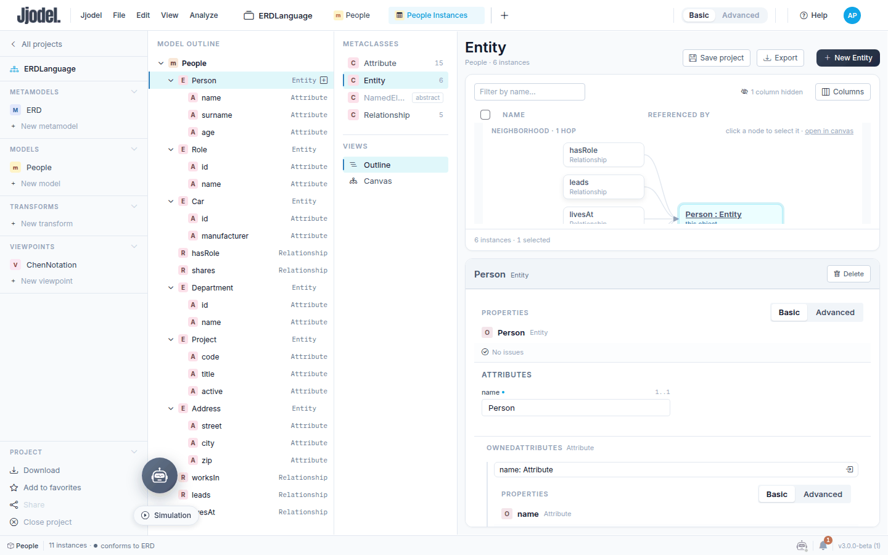
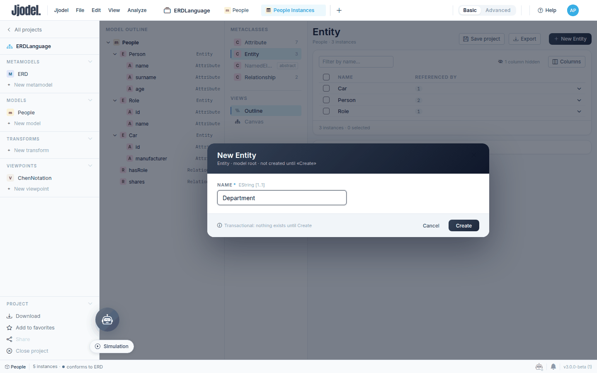
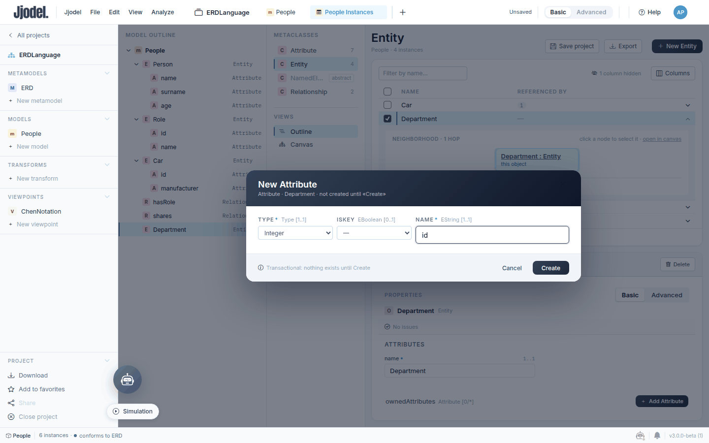
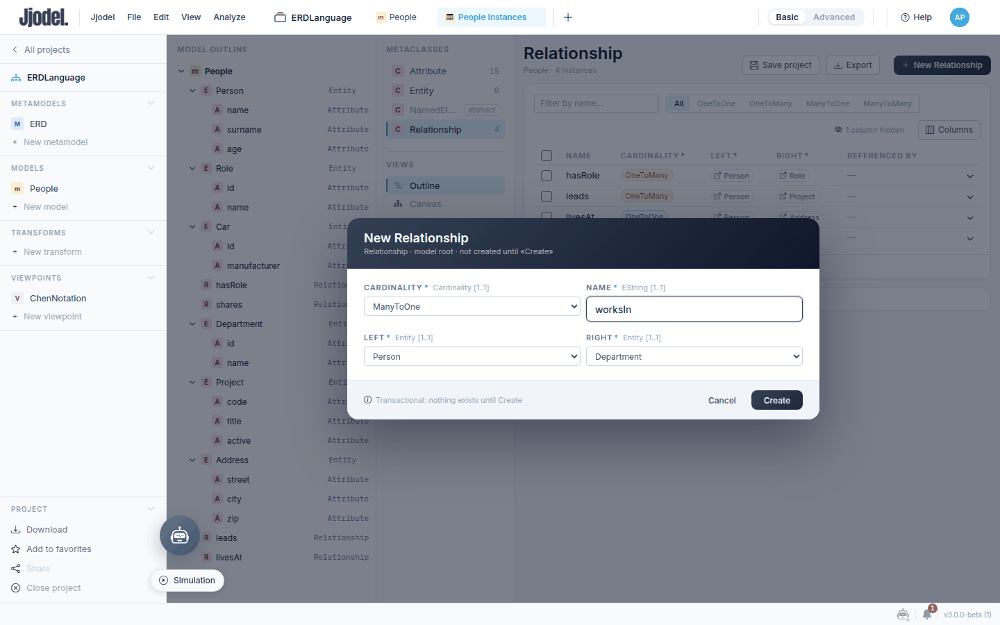
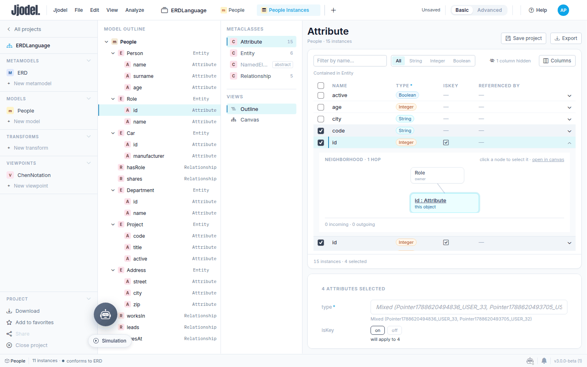
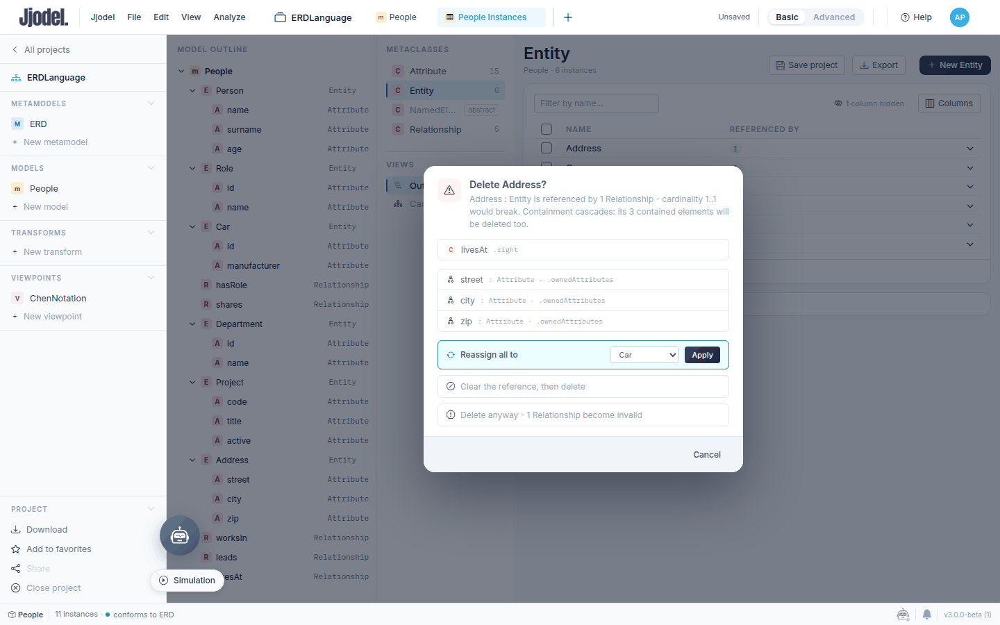
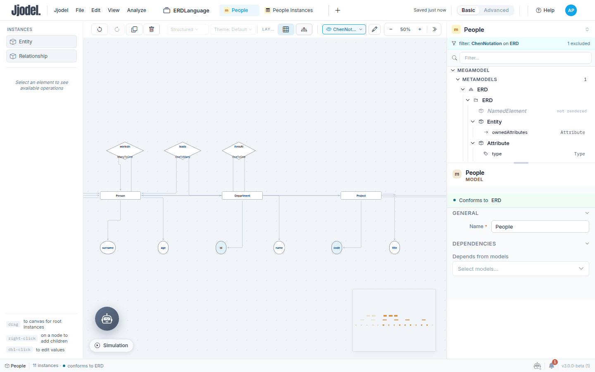

In this tutorial the `People` model grows from three entities to six, with three new relationships, and you do it without touching the canvas. The Data Manager shows a model as a table, one metaclass at a time, and edits it through forms. When a model is data rather than a drawing, a dozen entities with their attributes, it is the fastest way in.

<video controls preload="metadata" width="100%" poster="/videos/tutorial-04-data-manager-poster.jpg" src="/videos/tutorial-04-data-manager.mp4">
  Your browser does not support the video element. <a href="/videos/tutorial-04-data-manager.mp4">Download the video</a>.
</video>

The video (under three minutes) shows the creation steps at speed. Use it as a preview, then follow the text.

**Prerequisites:** the `ERDLanguage` project as left by [tutorial 2](../02-chen-notation), with the `People` model and the `ChenNotation` viewpoint. Everything here works in **Basic** mode.

**Time:** about 30 minutes.

## Step 1: Open the Data Manager

With `People` open on the canvas, open the viewpoint selector in the toolbar (it reads `ChenNotation` or `Abstract syntax`) and choose **Data manager**, the last entry. A tab named **People Instances** opens next to the model tab. You can also hover the model under **Models** in the project sidebar and click the table icon.

The tab has three columns. On the left, the **Model outline** shows the containment tree of the model: entities with their attributes, then the relationships. In the middle, **Metaclasses** lists the classes of `ERD` with the number of instances each one has; `NamedElement` is greyed out because it is abstract. On the right, the table for the selected metaclass. Click **Entity**: three rows, `Car`, `Person`, `Role`, with a **Referenced by** column that counts the relationships pointing at each one.

## Step 2: Create an entity

Click **New Entity** in the table header. A dialog opens: `New Entity · Entity · model root · not created until «Create»`. It has one field, `name`, marked as required, and a footer that says the draft is transactional: nothing exists in the model until you click **Create**, and Cancel leaves no trace.

Type `Department` and click **Create**. The row appears in the table, selected, and the form for the new instance opens below it: **Properties** with the conformance status (`No issues`), **Attributes** with the `name` field, and a section **ownedAttributes** that is empty and offers **Add Attribute**.

Try to create a second `Department`: the dialog refuses it with `An element named «Department» already exists here`. Two instances in the same container cannot share a name, whatever their metaclass.

## Step 3: Add attributes from the form

Click **Add Attribute** in the `ownedAttributes` section of `Department`. The dialog is `New Attribute · Attribute · Department`: the container is decided by the button you clicked, not by a field you fill. The form has three fields laid out from the metamodel: `type` (a dropdown with the three literals, required), `isKey` (a boolean, optional, so it starts unset), `name` (required).

Create two attributes: `id` of type `Integer`, and `name` of type `String`. Leave `isKey` unset for now; you will set the keys for all the new entities in one go later.

After each creation the table switches to the **Attribute** metaclass and selects the new row, so that you see what you just made in its own table. To add the next attribute, click **Entity** in the Metaclasses column and select `Department` again. The outline on the left keeps up: `Department` now lists `id` and `name`.

Repeat for two more entities:

`Project` with `code` (String), `title` (String), `active` (Boolean).

`Address` with `street`, `city`, `zip`, all String.

The Metaclasses column now reads `Entity 6` and `Attribute 15`.

## Step 4: Read a row

Click the `Person` row in the Entity table. The row expands into a **Neighborhood** diagram: `Person` on the right, the instances that point at it on the left, one hop away. Right now the two relationships `hasRole` and `shares` point at it. The table area keeps its height, so scroll inside it to see the whole diagram. The diagram is read-only; click a node to select that instance, or use **open in canvas** to see the same instance in the diagram, rendered with the active viewpoint.

Below the table, the form shows the same instance with its three attributes inline, each editable in place. Every change writes through the model: the outline, the canvas and the tree view update at once.

## Step 5: Create relationships

Click **Relationship** in the Metaclasses column, then **New Relationship**. The dialog has four fields: `cardinality` (the literals of the enumeration), `name`, `left` and `right`. The two reference pickers list `Address, Car, Department, Person, Project, Role` and nothing else: the metamodel says `left` and `right` are entities, so the picker offers only entities.

Create three relationships:

`worksIn`: left `Person`, right `Department`, cardinality `ManyToOne`.

`leads`: left `Person`, right `Project`, cardinality `OneToMany`.

`livesAt`: left `Person`, right `Address`, cardinality `OneToOne`.

The table shows the references as pills; the filter chips above it (`All`, `OneToOne`, `OneToMany`, ...) narrow the rows by cardinality, and the **Filter by name** box narrows them by name.

## Step 6: Edit several rows at once

Go back to the **Attribute** table. Tick the checkboxes of the four key attributes: the three `id` rows and `code`. The form area turns into a multi-edit form headed `4 attributes selected`. The `type` field reads **Mixed**, because the selection holds both `Integer` and `String` (in the current build the values behind it show as raw identifiers; the label is what matters); `isKey` shows how many are on and how many off, with an **on / off** switch. Identity is not there: the form says `Name is hidden: identity is never bulk-edited`.

Set `isKey` to **on** and click **Apply to 4**. The four rows get a tick in the `isKey` column (`Role.id` and `Car.id` already had it from tutorial 2), and if you open the canvas with `ChenNotation` active the key ovals are filled, as [tutorial 2](../02-chen-notation) set up.

## Step 7: Delete with a preview

Hover the `Address` row in the Entity table and click its trash icon. Before anything is removed, a dialog lists what the deletion touches: `livesAt` points at `Address` through `.right`, whose cardinality `1..1` would break, and the three contained attributes `street`, `city`, `zip` would go with it. You have four ways out: **Reassign all to** another entity and then delete, **Clear the reference, then delete**, **Delete anyway** and accept one invalid relationship, or **Cancel**.

Click **Cancel**. The point of the dialog is that the Data Manager knows the model, not just the row: containment cascades and incoming references are shown before you decide.

## Step 8: Back to the canvas

Press **Ctrl+S**, then switch to the `People` tab. With `ChenNotation` active and **Auto layout**, the diagram now shows six rectangles, fifteen ovals and five diamonds, laid out in one wide row; zoom out or pan to see it all. Nothing you did in the table needed the canvas, and everything you did is there.

## Customizing the form

The forms you used are laid out from the metamodel: field order and widths follow the features and their types. A dedicated Data Manager viewpoint, which lets you choose the widget for each field and a visual theme for the form, is in development and not in the public build yet. When it lands, this tutorial gains a step on it.

## What you learned

The Data Manager is a third way to look at a model, next to the canvas and the tree, and the right one when a model is a list of records. Creation is transactional and anchored to a container, so the metamodel's containment rules from [tutorial 1](../01-er-metamodel) decide where an instance can be born. Reference pickers offer only what the metamodel allows. Multi-edit writes one value to many instances and keeps identity out of it. Deletion shows its consequences before it happens.

## Next steps

The next tutorial lets Jjodie, the assistant, generate and explain parts of the project. For the table and the forms, see the [Data Manager](../../user-guide/data-manager) page.
