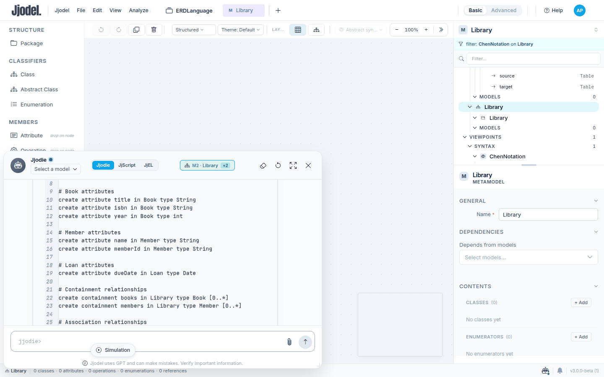
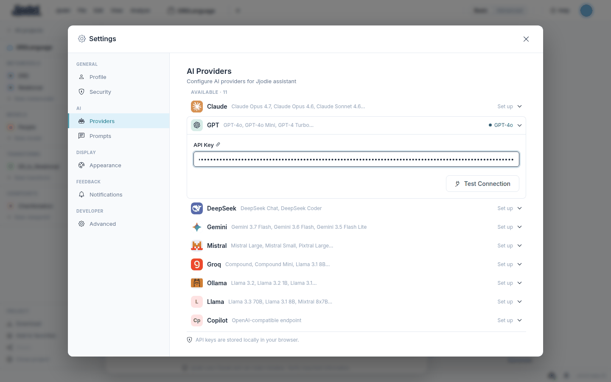
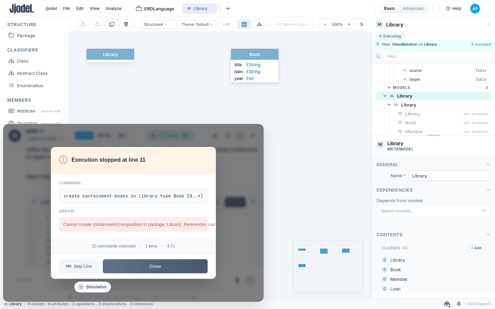
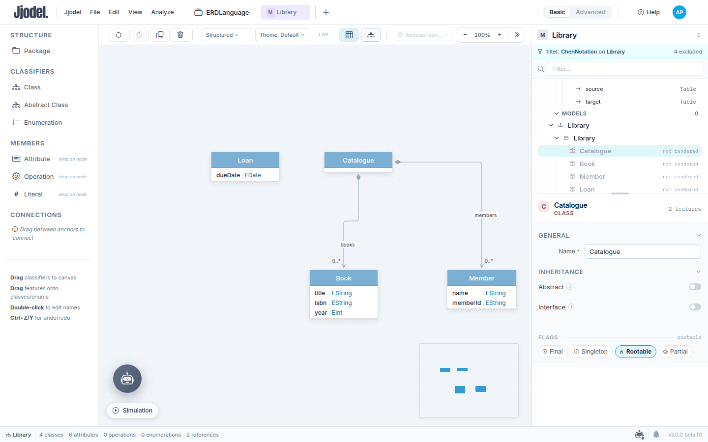
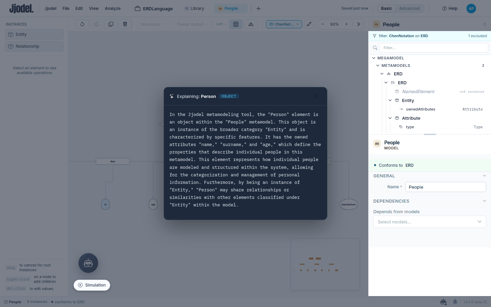
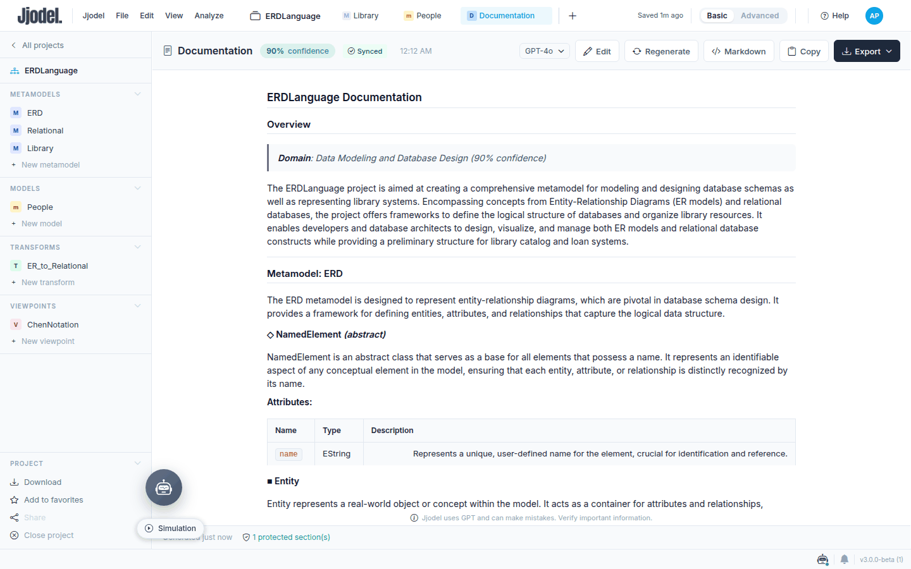
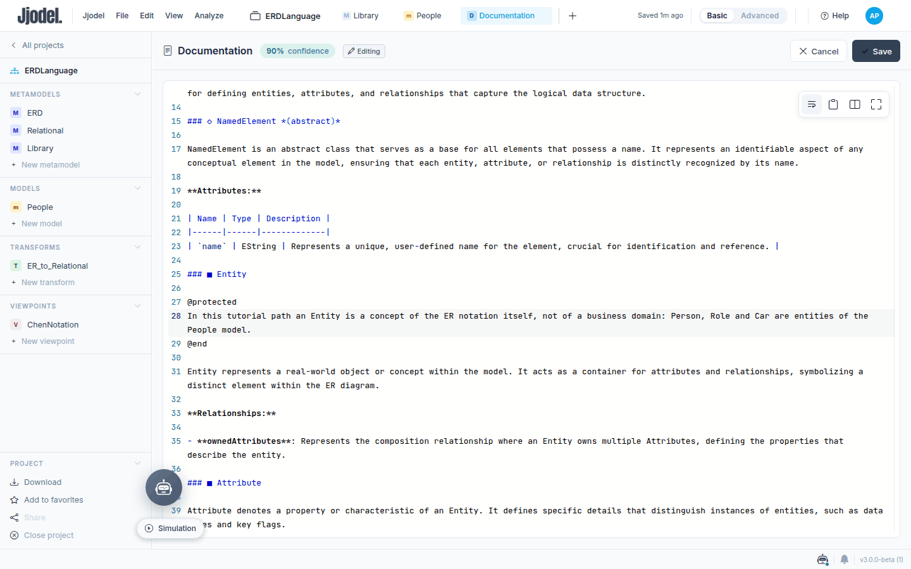
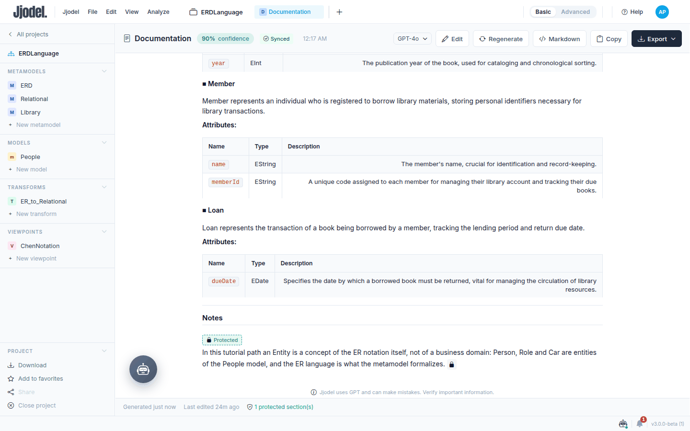
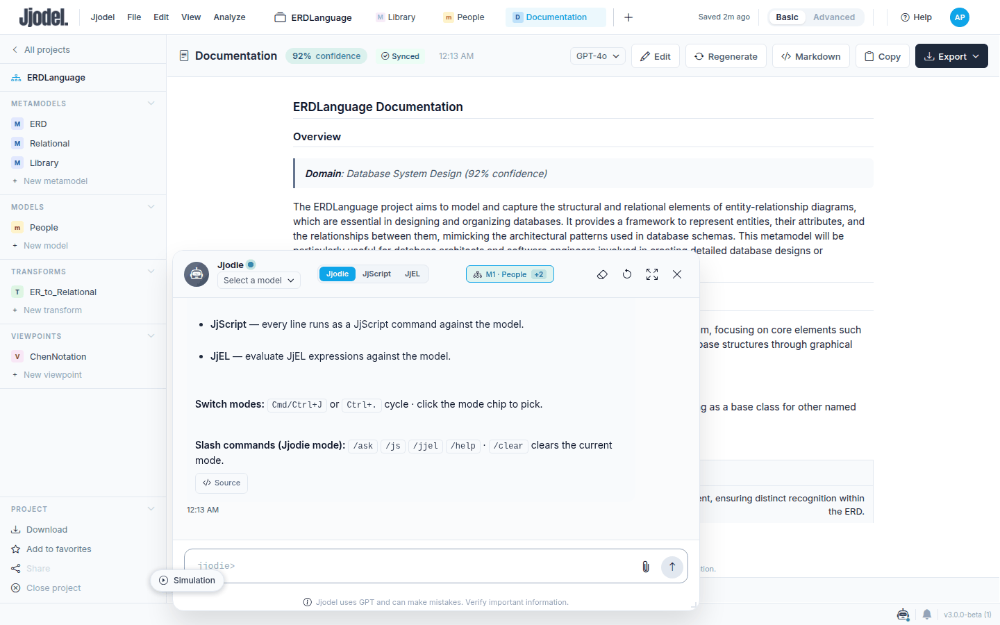

In this tutorial you use Jjodie, the assistant built into Jjodel, three times on the `ERDLanguage` project: for a metamodel you have not drawn, a library, reading the JjScript it produces before running it; to explain an entity of the `People` model in Chen notation; to document the project while keeping a paragraph you wrote by hand. Along the way a script fails on its second half, and you see how to recover.

<video controls preload="metadata" width="100%" poster="/videos/tutorial-04-jjodie-poster.jpg" src="/videos/tutorial-04-jjodie.mp4">
  Your browser does not support the video element. <a href="/videos/tutorial-04-jjodie.mp4">Download the video</a>.
</video>

The video (under three minutes) shows the six steps at speed, including the failing script. Use it as a preview, then follow the text.



**Prerequisites:** the `ERDLanguage` project as left by [tutorial 3](../03-data-manager), and an API key for one of the providers Jjodel supports (Claude, GPT, DeepSeek, Gemini, Mistral, Groq, Ollama and others; see [Providers](../../ai/providers)). Jjodel ships no key of its own: every call goes from your browser to the provider you configure, on your account. The steps use **Basic** mode.

**Time:** about 30 minutes, plus the waiting time of the provider.

## Step 1: Configure a provider

Open the project and click the round Jjodie button at the bottom left. The chat opens with a welcome message; the send button carries a warning icon because no provider is configured yet. Click it: Settings opens on **AI Providers**, with a **Set up** link on each of the eleven providers. Expand yours, paste the key in **API Key** and click **Test Connection**: the row gets a green dot with the default model, `GPT-4o` for GPT. Close Settings with Esc. Keys are stored locally in your browser, so a colleague opening the same project elsewhere configures their own.



Back in the chat, the header has three modes, **Jjodie**, **JjScript** and **JjEL** (the conversation, then direct commands and expressions), a model dropdown, and a context chip such as `M2 · ERD +1` that names the artifact the chat is bound to. Jjodie receives that artifact with every message.

## Step 2: A metamodel from a sentence

Click **New metamodel** in the sidebar and rename it `Library`. Open Jjodie: the chip now reads `M2 · Library`. Type one sentence and send it:

```text title="Jjodie"
Create a metamodel for a library: a Library that contains Books and Members; a Book has a title, an isbn and a year; a Member has a name and a memberId; a Loan links one Member to one Book and has a dueDate. Use containment where it makes sense.
```

The answer has two parts: a paragraph that says what it is about to do, and a **JJSCRIPT** block with **Run** and **Copy** in its header. Read the block: four classes, the attributes with their types, then `create containment` for `books` and `members` and `create reference` for `loans`, `book` and `member`. Nothing has changed yet: Jjodie never edits, it proposes a script and you run it. `String` and `int` will become `EString` and `EInt`, and `Date`, which you did not ask for, `EDate`.

## Step 3: Run it, watch it fail, fix it

Click **Run** in the block header. The block becomes a script panel with **Step**, which executes one command at a time, and **Run**. Click **Run**. The first ten commands get a check mark, then execution stops at line 22: `Cannot create containment/composition in package 'Library'. References can only be added to classes.` The metamodel is named `Library` and so is the class; `in Library` resolves to the package. The dialog offers **Skip Line** and **Close**, a summary follows (ten commands, one error), and the panel shows an **Error** badge.



Recover in two moves. In the tree, select the class `Library` and rename it `Catalogue` in the properties panel. Then tell Jjodie what happened, error message included, and ask only for what is missing:

```text title="Jjodie"
The script stopped at line 22: Cannot create containment/composition in package 'Library'. The metamodel has the same name as the class. I renamed the class to Catalogue; give me only the commands that are still missing.
```

The answer is a five-line script with the two containments and the three references on `Catalogue` and `Loan`. Run it: five check marks, **Completed**. Click **Auto layout** and save. The `Library` metamodel has four classes, six attributes and five references, and you typed none of them.



Two habits make this reliable: read the script before running it, and when something fails paste the exact message, which names the command and the reason. To fix a line yourself, **Copy** the block, edit it, and paste it into the input in **JjScript** mode.

## Step 4: Explain an element of the Chen diagram

Open the `People` model with `ChenNotation` active. Right-click the `Person` rectangle: the context menu ends with **Explain this**, after the editing entries and **Edit view · EntityView**. Click it.

A window titled `Explaining: Person`, tagged **OBJECT**, streams a short text: `Person` is an instance of `Entity`, it owns `name`, `surname` and `age`, and other elements can reference it. The text is generated from the element's type, features and values, for someone learning MDE. It is not stored: close the window and it is gone.



**Explain this** works on classes, attributes and references as well as on instances, whatever the active viewpoint. It is a reading aid, not documentation: in the example, Jjodie calls the model a metamodel once.

## Step 5: Generate the documentation

On the project page, scroll to **Documentation**, the last card, and click **Generate**. A **Documentation** tab opens at once with a first document marked `0% confidence` and `Generated: Local`: the fallback generator, which works from names and types alone and guessed the domain from the class `Car`. In the toolbar of the tab pick your model in the provider dropdown and click **Regenerate**; confirm the dialog. A progress window lists the stages (structure, Wikidata definitions for the class names, prompt, generation, parsing, merging protected sections, saving) and takes about half a minute.

The result is Markdown rendered in the tab: an overview with the domain and a confidence score (`90%` in the video), a section per metamodel, a subsection per class with a paragraph and a table of attributes and references, each described, and a closing **Notes** section. **Markdown** shows the source; **Copy** and **Export** take it out as text or PDF.



## Step 6: Protect a paragraph and regenerate

Click **Edit**. The Markdown opens in an editor. Under the heading of `Entity`, add a paragraph between two markers:

```markdown title="Documentation (Markdown)"
@protected
In this tutorial path an Entity is a concept of the ER notation itself, not of a business domain: Person, Role and Car are entities of the People model.
@end
```

Click **Save**. In the formatted view the paragraph carries a **Protected** badge and a lock icon, and the status line counts the protected sections.



Click **Regenerate** again and confirm. Every generated sentence is rewritten, the confidence score moves by a few points, and your paragraph is still there, with its lock. In the current build protected blocks are gathered under **Notes** at the end rather than kept where you wrote them, so write them as self-contained notes, not as continuations of a generated paragraph.



The document is stored in your browser under the project id, not in the project. When a metamodel changes, the card shows **Outdated**; **Regenerate** brings it back in line. Use **Export** when the documentation has to travel with the project.

## Meta-commands

The chat input accepts commands that start with a slash. `/help` lists them: `/ask` switches to Jjodie mode, `/js` and `/jjel` to the JjScript and JjEL modes, `/clear` empties the transcript. An unknown command is reported, not sent to the provider. A line that already parses as a JjScript command is not sent either: a card offers to run it or to ask Jjodie about it.



## What you learned

Jjodie works in three registers. In the chat it turns a request into JjScript that you inspect and run, and a failure is a message to feed back to it. On the canvas, **Explain this** reads any element for you. On the project page, documentation generation returns a document you can edit and regenerate with your own paragraphs protected. All three send your project to the provider you configured, and nothing leaves the browser without a key of yours.

## Next steps

The next tutorial writes a JjTL transformation from the ER metamodel to a relational schema. For the assistant itself, see [Jjodie](../../ai/jjodie), [Documentation Generation](../../ai/documentation) and [Providers](../../ai/providers).
