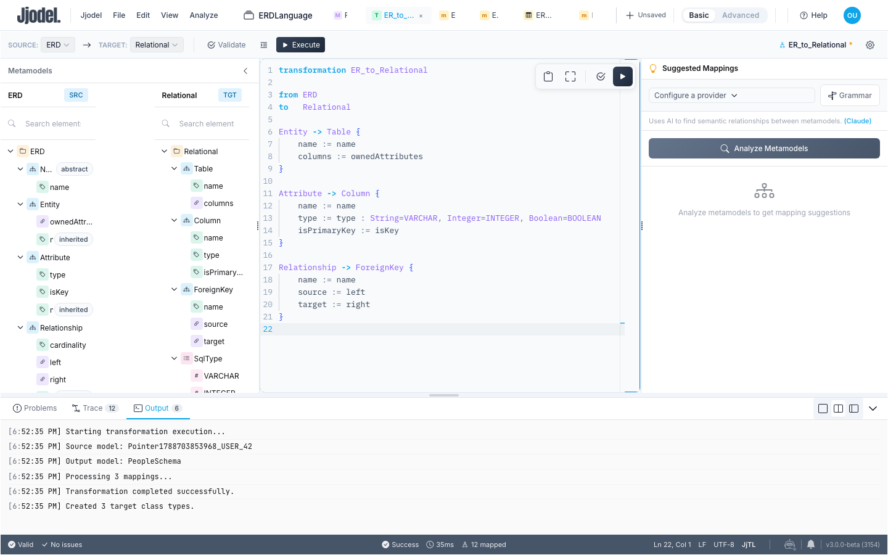
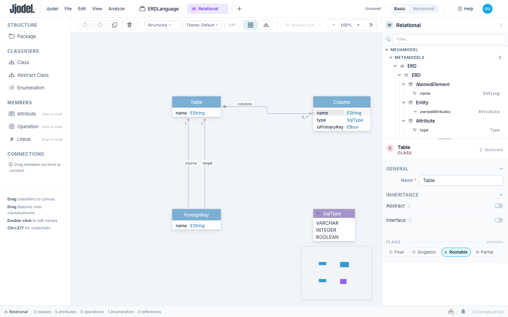
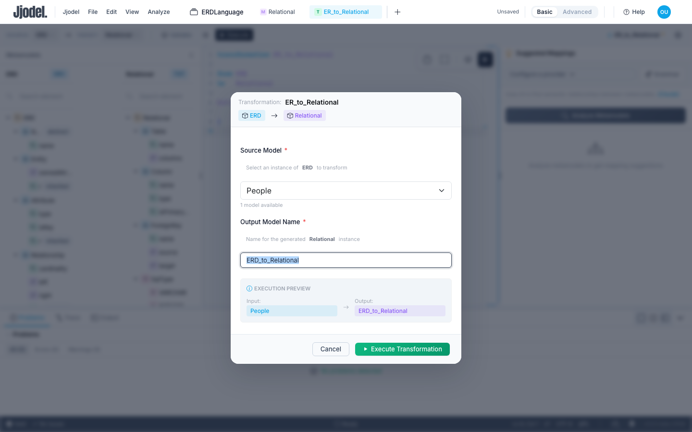
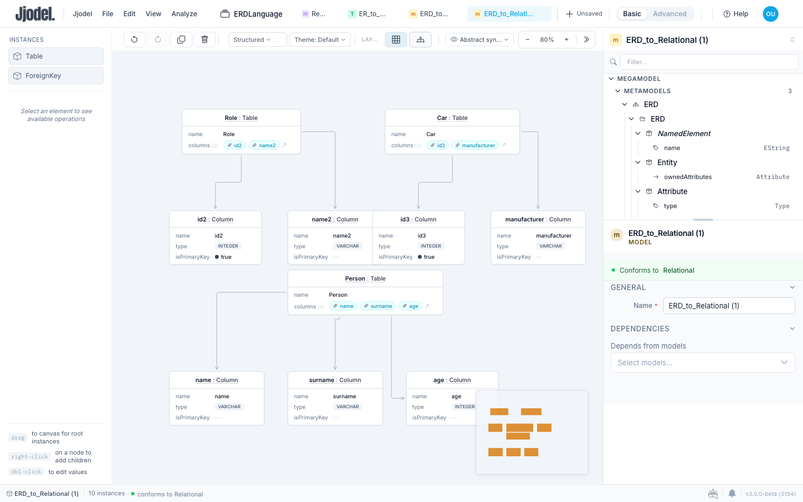
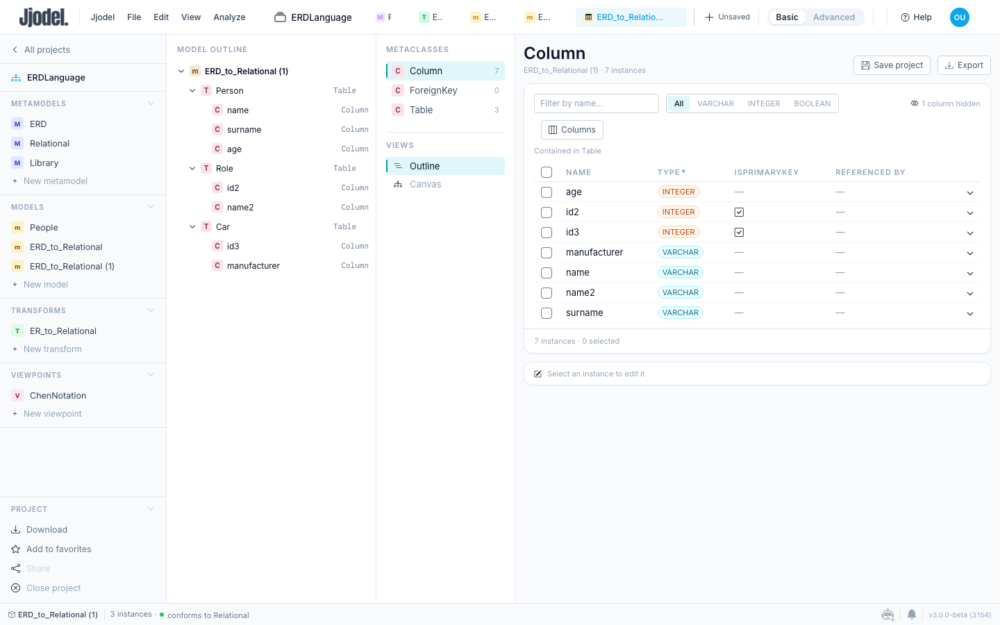
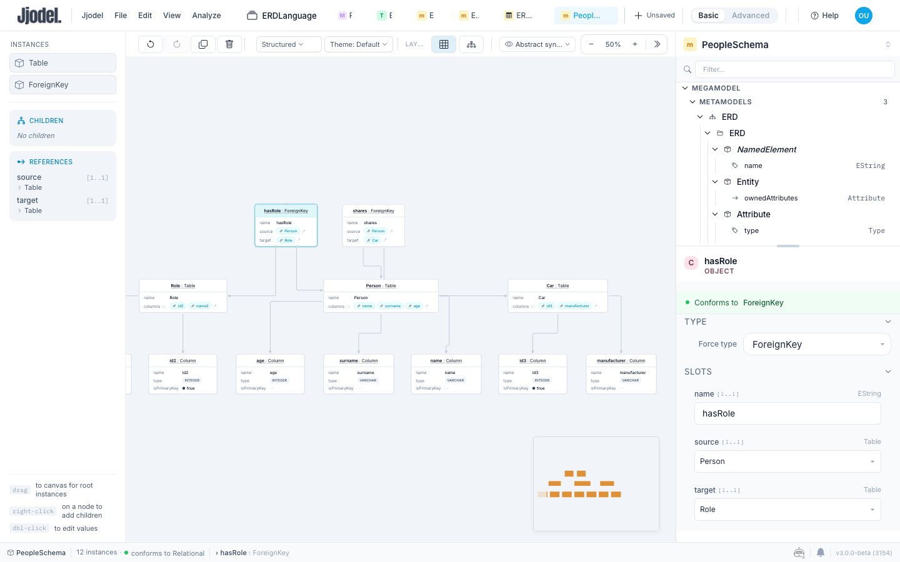
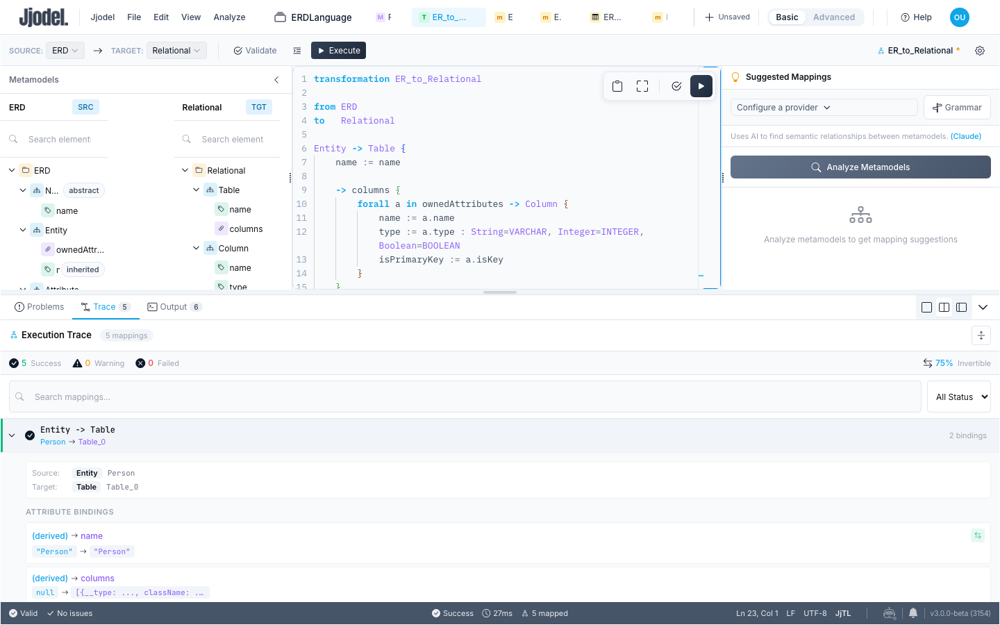

In this tutorial you write your first model-to-model transformation. The source is the `People` model of the previous tutorials; the target is a relational schema, described by a second metamodel you define first. The transformation is short, two rules, but it exercises the parts of JjTL you will use most: attribute bindings, objects created inside a containment feature, one object per element of a collection, a value mapping between two enumerations, and references that point from one target element to another.

<video controls preload="metadata" width="100%" poster="/videos/tutorial-05-er-to-relational-poster.jpg" src="/videos/tutorial-05-er-to-relational.mp4">
  Your browser does not support the video element. <a href="/videos/tutorial-05-er-to-relational.mp4">Download the video</a>.
</video>

The video (under two minutes) shows the five steps at speed. Use it as a preview, then follow the text.



**Prerequisites:** the `ERDLanguage` project with the `ERD` metamodel of [tutorial 1](../01-er-metamodel), including the `isKey` flag added in [tutorial 2](../02-chen-notation), and the `People` model with its three entities (`Person`, `Role`, `Car`) and two relationships (`hasRole`, `shares`). If you grew the model in [tutorial 3](../03-data-manager), everything below still applies; the counts you check simply become six tables, fifteen columns and five foreign keys. The steps use **Basic** mode.

**Time:** about 45 minutes.

## Step 1: The Relational metamodel

A transformation needs a target metamodel. Click **New metamodel** in the project sidebar, rename it `Relational`, and build it as you did in tutorial 1:

1. Drag **Enumeration** onto the canvas, name it `SqlType`, and give it three literals: `VARCHAR`, `INTEGER`, `BOOLEAN`.
2. Drag **Class** onto the canvas and name it `Table`. Drop an **Attribute** on it, name it `name`, type `EString`.
3. Add a class `Column` with three attributes: `name` (`EString`), `type` (choose the enumeration `SqlType` in the Type dropdown), `isPrimaryKey` (`EBoolean`).
4. Connect `Table` to `Column` and choose **Composition**. Rename the reference `columns` and keep its multiplicity `[0..*]`. A table owns its columns, as an entity owns its attributes.
5. Add a class `ForeignKey` with an attribute `name` (`EString`), then connect it to `Table` twice with **Association**: rename the references `source` and `target`, multiplicity `[1..1]` each.

Save. The status bar reads **3 classes, 5 attributes, 0 operations, 1 enumeration, 3 references**. `Column` is not rootable anymore, because it is the target of a composition.



## Step 2: Create the transformation

On the project page, click **New transform** in the **Transformations** section and name it `ER_to_Relational`. Transformation names use letters, digits and underscores; hyphens are not accepted. The editor opens with the source and target metamodels side by side on the left, the code in the middle, and a panel at the bottom with **Problems**, **Trace** and **Output**. The top bar carries the **Source** and **Target** selectors, **Validate** and **Execute**.

Select `ERD` as **Source** and `Relational` as **Target** in the top bar. The two structures appear on the left, tagged **SRC** and **TGT**. Replace the code with the header:

```jjtl title="ER_to_Relational"
transformation ER_to_Relational

from ERD
to   Relational
```

## Step 3: Entities become tables

Add the first rule under the header:

```jjtl
Entity -> Table {
    name := name
}
```

A rule reads as "for every `Entity` in the source model, create a `Table`". Inside the braces, `name := name` copies the entity's `name` into the table's `name`: the left side is a feature of the target class, the right side is an expression evaluated on the source instance, whose features are in scope by name. As you type, an arrow appears between `Entity` and `Table` in the metamodel panels.

Click **Validate**: the Problems tab reports no problems. Then click **Execute**. A dialog asks for two things: the **Source Model**, a dropdown that lists the models conforming to `ERD` (only `People`, here), and the **Output Model Name**, prefilled with `ERD_to_Relational`; keep it. An execution preview restates the input and the output. Click **Execute Transformation**.

A new model appears under **Models** in the sidebar, tagged `Model · Relational`, with three instances of `Table` named `Person`, `Role` and `Car`. Open it: three boxes and nothing else, since the rule has said nothing about columns yet.



## Step 4: Attributes become columns

The attributes of an entity live inside it, in `ownedAttributes`, and the columns of a table must live inside the table, in `columns`. JjTL expresses both with one construct. Extend the rule:

```jjtl
Entity -> Table {
    name := name

    -> columns {
        forall a in ownedAttributes -> Column {
            name := a.name
            type := a.type : String=VARCHAR, Integer=INTEGER, Boolean=BOOLEAN
            isPrimaryKey := a.isKey
        }
    }
}
```

Read it from the outside in. `-> columns { ... }` names the feature of `Table` that will receive new objects. `forall a in ownedAttributes -> Column { ... }` creates one `Column` per attribute of the entity, with `a` bound to the attribute. The three bindings fill the column: `a.name` copies the name; `a.isKey` copies the key flag into `isPrimaryKey`; the middle line is a value mapping, which converts the `Type` literal of the ER attribute into the `SqlType` literal of the column. The pairs after the colon are read left to right, source value then target value, and enumeration literals are written by name.

Execute again on `People`; the dialog proposes `ERD_to_Relational_1` as the output name, since the first name is taken. A second target model appears. Each table now lists its columns as pills in the `columns` row: three for `Person`, two for `Role`, two for `Car`. The columns take the names of the attributes they come from, which are the names Jjodel gave them when you created them in tutorial 1: `id2`, `name2` and `id3` rather than a second `id`, a second `name` and a third `id`, because two elements of the same model cannot share a name.



To check the types and the keys, open the viewpoint selector in the toolbar and choose **Data manager**, then click **Column** under Metaclasses. The table lists the seven columns with their `type` and `isPrimaryKey`: `VARCHAR` for the string attributes, `INTEGER` for `age`, `id2` and `id3`, and the primary key flag on `id2` and `id3` only, the two attributes you flagged with `isKey` in tutorial 2. The header says `Contained in Table`: the columns are contained instances, exactly where `columns` puts them.



The rule would have been wrong in two other forms, and the editor tells you so. `-> Column { ... }` directly in the rule body, with no feature around it, is a validation error: there is no slot to put the object in. `forall` directly in the rule body, without `-> columns`, runs but has to guess the feature; the Output panel then names the guess and asks you to write it. The explicit form costs one line and removes the guess.

## Step 5: Relationships become foreign keys

Add the second rule after the first:

```jjtl
Relationship -> ForeignKey {
    name := name
    source := left
    target := right
}
```

`left` and `right` are references to entities, but `ForeignKey.source` and `ForeignKey.target` expect tables. You do not convert them yourself. Every table created by the first rule is recorded in the trace together with the entity it came from, and when a binding evaluates to a source element that has a corresponding target element, the executor substitutes the target. This is cross-type resolution, and it works whatever the order of the rules, because all target instances are created before any binding is evaluated.

Execute once more, and this time type `PeopleSchema` as the output name. The new model has three tables with their columns and two foreign keys: `hasRole` from `Person` to `Role`, `shares` from `Person` to `Car`. Select `hasRole`: `source` and `target` point at tables of this model, not at entities of `People`, and the canvas draws the two references as edges.



## Step 6: Read the trace and the Output

Open the **Trace** tab. It lists one entry per rule application: `Entity -> Table` three times, `Relationship -> ForeignKey` twice, each with the source element and the target element it produced. Expand an entry to see its bindings with the source value, the target value and whether the binding can be inverted: `name := name` can, the value mapping on `type` can as long as no two source literals map to the same target literal, `source := left` records the resolution that took place.

The **Output** tab reports the run: rules executed, instances created, bindings applied, time. It is also where warnings go. Execution does not stop on a warning, so when a target model is not what you expected this is the first place to look: a feature name that does not exist on the target class, a value that reached no attribute, an enumeration name that matched no literal are all named here with the instance they concern.



## Cleaning up

Every execution creates a new target model, and the dialog appends `_1`, `_2` to the proposed name when it is already taken. Delete `ERD_to_Relational` and `ERD_to_Relational_1` from the project page (the menu of each card has **Delete**, with no confirmation), keep `PeopleSchema`, and save.

## What you learned

A JjTL transformation is a list of rules, each mapping a source class to a target class, with bindings that fill the target's features from expressions on the source. Objects that belong inside another object are created in the feature that holds them, with `-> feature { ... }`, and `forall` creates one per element of a collection. Value mappings translate between enumerations by literal name. References across the two models resolve through the trace, so you write `source := left` and get a table. The trace and the Output panel show what happened, binding by binding.

## Next steps

The [JjTL Reference](../../languages/jjtl) covers guards, multiplicities, explicit `resolve`, helpers and the current limitations; the [Transformation Editor](../../user-guide/transformation-editor) page describes the editor itself. Tutorial 6, [State Machine Simulation](../tutorial-04-simulation), leaves the ER example for a language with an operational semantics.
