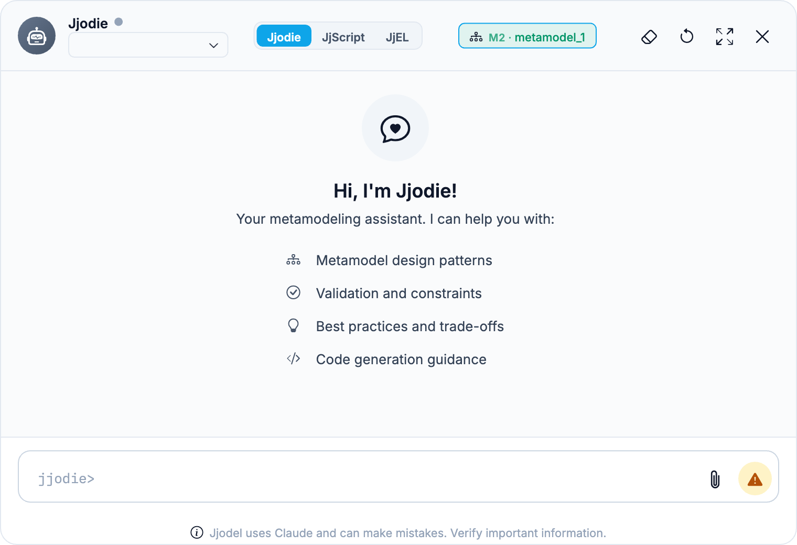

The Console is the interactive surface of Jjodel: a single input that speaks three languages. You can talk to the Jjodie AI assistant in natural language, execute [JjScript](../../languages/jjscript) commands, or evaluate [JjEL](../../languages/jjel) expressions, switching mode at any time. A JavaScript flavor is also available for direct access to the JjOM API.

## Accessing the Console

The Console opens as a floating window over the workspace. Click the assistant icon in the status bar at the bottom of the window, or the round assistant button on the canvas.



Its header carries, from left to right: the AI provider in use (**Configure a provider** until you set one), the three mode chips, and a context chip naming the level and the artifact the Console is bound to, for example `M2 · metamodel_1`. The buttons on the right clear the transcript, restart the session, expand the window, and close it. The prompt itself changes with the mode, so you can always see which language you are typing.

## Console modes

| Mode | Language | Typical input |
|------|----------|---------------|
| **Jjodie** | Natural language | "add a name attribute of type String to Person" |
| **JjScript** | Imperative commands | `create class Person` |
| **JjEL** | Pure expressions | `forall c in classes : c.name` |

Multi-language modes are available since Jjodel 3.0.

The three modes sit side by side as chips in the console header, and the active one is highlighted. Three ways to switch:

- **Click a chip**
- **Cmd+J** (Ctrl+J on Windows/Linux) cycles through the modes
- **Meta-commands** typed directly in the input: `/jjel`, `/js`, `/ask` (back to Jjodie), `/help`

Input history (arrow up/down) is shared between Jjodie and JjScript; the expression modes keep their own history. `/clear` empties the console.

### Jjodie mode

Jjodie is the AI assistant. It answers questions about MDE, Jjodel, and your models, and for editing requests it generates JjScript blocks that you run from the chat. The AI backend is configurable in Settings under Providers (Claude, GPT, Ollama, and others). The [AI chapter](../../ai/overview) covers Jjodie, the providers, and the other AI features in detail.

### JjScript mode

Inputs run directly as JjScript commands, with autocompletion for commands, class names, and types:

```jjscript title="Console (JjScript mode)"
create class Person
create attribute name in Person type EString [1]
show Person full
validate all
```

See the [JjScript Reference](../../languages/jjscript) for the full command set.

### JjEL mode

Inputs are evaluated as JjEL expressions against the active metamodel and model. These identifiers are bound in the console context:

| Identifier | Returns |
|------------|---------|
| `classes` | All classes in the active metamodel |
| `attributes` | All attributes in the active metamodel |
| `references` | All references in the active metamodel |
| `enumerations` | All enumerations in the active metamodel |
| `packages` | All packages in the active metamodel |
| `instances` | All instances in the active model(s) |
| `metamodel`, `project` | The active metamodel and the current project |
| `data`, `node` | The selected element and its layout node (require a selection) |

Classes are also bound by name: `Person.name`, `Person.attributes`. Instance names resolve directly when unambiguous.

```jjel title="Console (JjEL mode)"
> forall c in classes such that c.isAbstract : c.name
["NamedElement"]

> exists a in Person.attributes | a.type == "EString"
true

> with data do name.pascalCase()
"CustomerOrder"
```

JjEL is side-effect-free: expressions read the model but never modify it. See the [JjEL Reference](../../languages/jjel) for the full language.

## JavaScript and the JjOM

The `/js` flavor evaluates plain JavaScript with direct access to the Jjodel Object Model. This is the lowest-level surface, useful for debugging viewpoints and exploring the runtime object graph.

```javascript title="Console (JS)"
// All elements of the current model
model.elements()

// Only instances of a specific metaclass
model.elements().filter(e => e.instanceof.name === 'Entity')

// User-defined features use the $ prefix
myEntity.$ownedAttributes.map(a => a.$name)

// Metaclass information
myElement.instanceOf.isAbstract
data.className    // "DClass" on a metamodel element, "DObject" on a model element
```

When a metamodel class has a user-defined attribute called `name`, `data.name` returns the same value as `data.$name.value`.

The node and view submodels are exposed too:

```javascript title="Console (JS)"
node.x
node.y
view.jsCondition
// → "context DObject inv: self.instanceof.name = 'Entity'"
```

## Practical use cases

- **Testing predicates** before using them in viewpoint definitions: write the predicate in the Console, verify it selects the right elements, then copy it into the view configuration.
- **Prototyping JjEL expressions** before using them in JjTL guards and mappings.
- **Exploring the JjOM structure** to understand how your metamodel maps to the runtime object graph; essential when writing JSX templates that navigate references.
- **Bulk edits** through JjScript (`forall a in attributes such that a.isDerived do delete a`).

## Log messages

The Console also serves as a log viewer, displaying messages generated by validation rules, event handlers, and system operations (save, load, synchronization). Log entries are timestamped and color-coded by severity.

:::tip
Use the Console as your first tool when a viewpoint template does not render as expected. Navigate to a specific element and check that the properties you reference in your template actually exist and contain the values you expect.
:::
