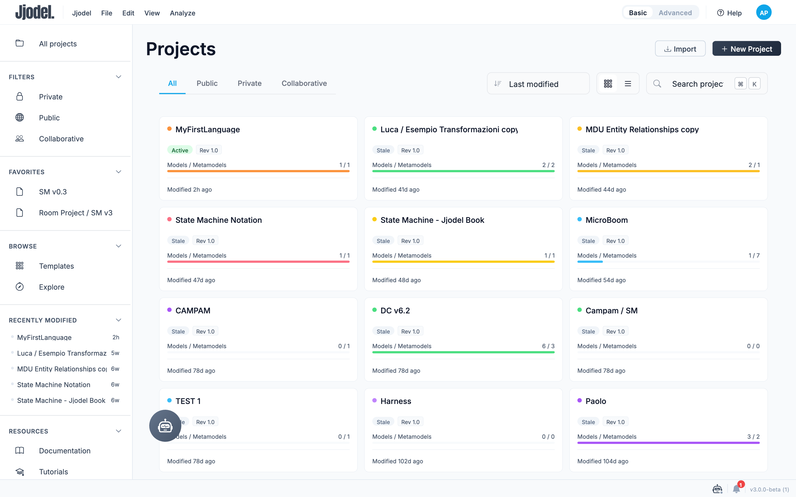
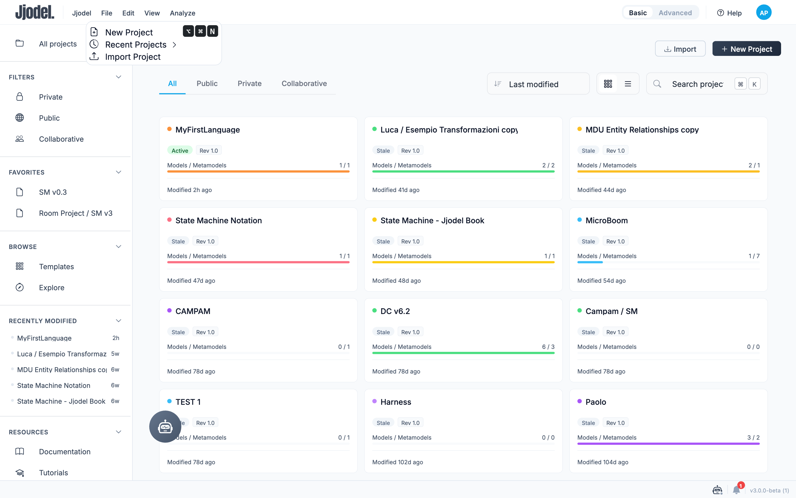
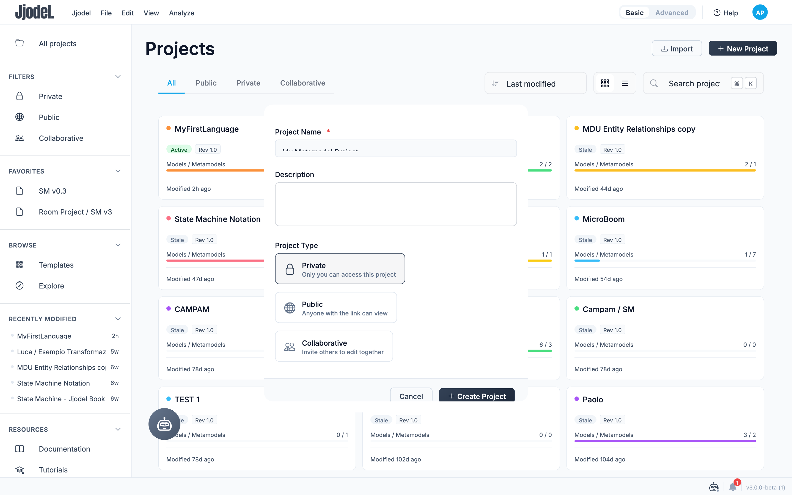
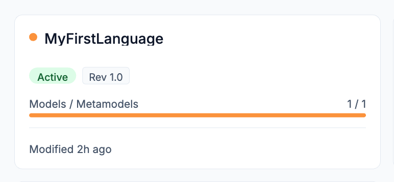
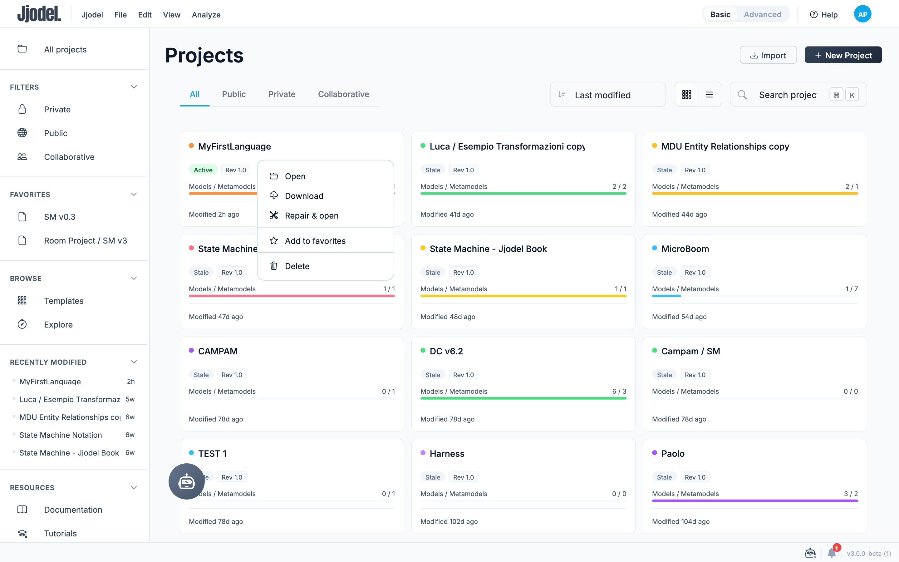

The Dashboard is the first screen you see after logging in. It lists every project you have access to and gives you the entry points to create, import, and organize your work.

## Overview

The Dashboard is organized into a sidebar and a main project list.

The sidebar gives you:

- **All projects** — the default view, listing everything you have access to
- **Filters** — jump straight to **Private**, **Public**, or **Collaborative** projects
- **Favorites** — projects you starred for quick access
- **Browse** — **Templates** to start a project from a predefined structure, and **Explore** to discover public projects from other users
- **Recently Modified** — a shortcut list of the last few projects you touched
- **Resources** — links to **Documentation**, **Tutorials**, the **API Reference**, and the **GitHub** repository

The main area lists your projects as cards (or as a table, see [Grid and list view](#grid-and-list-view) below), with **Import** and **New Project** buttons in the top-right corner, filter tabs (**All** / **Public** / **Private** / **Collaborative**), a sort dropdown, a grid/list toggle, and a search box.

## Creating a Project

You can start a new project in two equivalent ways:

- Click **+ New Project** in the top-right corner of the Dashboard
- Open the **File** menu in the top bar and select **New Project** (`⌥⌘N`)

The same **File** menu also holds **Recent Projects**, a submenu listing the projects you opened most recently, and **Import Project**, which loads a project file previously exported from Jjodel.

Both entry points open the same dialog:

- **Project Name** is required, marked with an asterisk
- **Description** is optional and can be filled in later
- **Project Type** decides who can reach the project:
  - **Private** — only you can access it
  - **Public** — anyone with the link can view it
  - **Collaborative** — you invite other people to edit it with you

**Private** is preselected. The type you pick here is what the sidebar filters and the **All** / **Public** / **Private** / **Collaborative** tabs group your projects by, and it appears in the **Type** column of the list view. Click **Create Project** to confirm, or **Cancel** to discard.

If you have no projects yet, the Dashboard shows an empty state with a **New project** button and quick links to the getting started guide, the video tutorials, and the documentation.

## Project Cards

Each card represents a self-contained project workspace. A project in Jjodel can contain:

- One or more **metamodels** defining the language structure
- One or more **models** conforming to those metamodels
- One or more **transformations** between metamodels
- One or more **viewpoints** defining visual representations

A card condenses the project state into two rows:

- The colored dot next to the name identifies the project; the bar further down repeats the same color
- **Active** marks the project you currently have open. Every other project shows **Stale** until you open it
- **Rev 1.0** is the project revision
- **Models / Metamodels** counts both, in that order, so `1 / 1` means one model and one metamodel. The bar underneath summarizes the ratio between the two
- **Modified** is the time elapsed since the last save

Click anywhere on a card to open the project workspace.

### Managing a Project

Hovering a card reveals a star button and a **⋯** menu in its top-right corner. The star toggles the project in and out of your favorites directly. The menu holds the full set of actions:

- **Open** — enter the project workspace, same as clicking the card
- **Download** — export the project as a file you can archive or import again later
- **Repair & open** — attempt to fix a project that fails to load correctly, then open it
- **Add to favorites** — pin the project to the **Favorites** section of the sidebar
- **Delete** — permanently remove the project

:::caution
Deleting a project cannot be undone.
:::

## Grid and List View

Use the toggle next to the sort dropdown to switch between the card grid and a compact table (**Name**, **Type**, **Rev**, **Metamodels**, **Models**, **Modified**), where **Type** shows whether the project is **Private**, **Public**, or **Collaborative**. The table view also lets you select multiple projects with checkboxes for bulk actions.

## Sorting and Searching

The sort dropdown reorders your project list by **Last modified**, **Oldest modified**, **Recently created**, **Name (A to Z)**, or **Name (Z to A)**. The search box next to it filters the list as you type, matching against project names.

:::note
All projects are stored in the cloud. You can access them from any device by logging into your account.
:::
