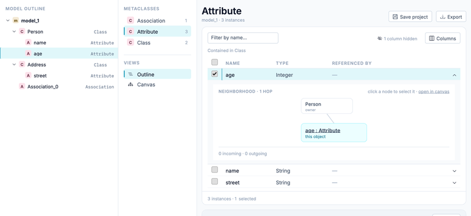

The Data Manager is a third way to look at a model, next to the canvas and the tree view. It shows the instances of a model as a table, one metaclass at a time, and lets you create, edit and delete them through forms. It needs no viewpoint and no diagram: it reads the metamodel and shows what the model contains.

Available since Jjodel 3.0 (September 2026 update).

Use it when the model is data rather than a drawing: a catalogue of products, a list of states and transitions you want to fill in quickly, a model imported from XMI that has no layout yet.

## Opening the Data Manager

There are two entry points, both on a model:

- In the project sidebar, hover a model under **Models** and click the table icon (**Open instance manager**).
- With a model open on the canvas, open the syntax picker in the toolbar and choose **Data manager**. It is the last entry of the list, after the viewpoints.

The Data Manager opens as a tab of its own for that model. The right-hand properties rail is hidden while the tab is active: editing happens in the table and in the form.

## Layout

The left rail lists the **Metaclasses** of the metamodel with the number of instances each one has. Click a metaclass to load its instances in the table. A second entry, **Model outline**, shows the containment tree of the model from its root instances; it is a navigation aid, the table stays the place where you edit.

The table has one row per instance and one column per attribute or reference. Columns that are empty for every row are hidden; the **Columns** control lists them and lets you show them again. The name column is always visible. A filter box (**Filter by name…**) narrows the rows; the footer pages the table.

Values render with the same renderers used inside canvas nodes: enumeration literals as chips, references as pills you can follow, colours as swatches, booleans as a filled or hollow dot. See [View Designer](../view-designer/#row-views) for the full list.

## Creating an instance

Creation is anchored to a container: the outline offers an **Add inside …** button for the model root and for every instance that can hold children, so the container is decided by the button you use rather than by a field in the form. A draft form then opens with one field per feature of the metaclass, laid out from the metamodel: short fields (numbers, booleans, enumerations, colours) take a quarter of the row, text and references half, multiline text the full row. You never set widths by hand.

Required fields (lower bound 1) carry a small dot next to the label. A draft with a missing required value is reported, not blocked: you can save it and fix it later, and the conformance check will list it.

An attribute marked as **ID** of type `EInt` numbers itself: the draft shows no field for it, and the new instance takes the highest existing value plus one.

Containment is set at creation and cannot be changed from the form; identity (the name) can.

## Editing

Click a row to expand it. The expanded row shows the form for that instance and, next to it, a small **neighborhood** diagram: the instance in the middle, the instances that point at it and the ones it points to, one hop away. The diagram is read-only; click a node to select it. Anything beyond one hop belongs to the canvas: **Canvas** opens the diagram filtered on this instance.

Every widget writes through the model, so the tree view and any open diagram update at once. A reference picker lists only the instances the metamodel allows for that reference; a containment reference cannot point at an ancestor of the instance.

Selecting several rows opens a multi-edit form. Fields whose values differ across the selection show a mixed state; setting a value writes it to every selected instance. Identity and containment are absent from the multi-edit form, and the form says why.

## Deleting

Select one or more rows and choose delete. Before anything is removed, the Data Manager shows what the deletion touches: the contained instances that go with it (the containment cascade) and the instances that still point at the ones you are deleting. You can **Clear the references, then delete**, or **Reassign all, then delete** to a target of your choice, or cancel.

## Names

Two instances that share a container cannot have the same name, whatever their metaclass. The Data Manager refuses such a name at creation and when you rename. Instances in different containers may share a name: two `Member` instances called `John` in two different `Family` instances are fine.

Auto-generated names (`State_0`, `State_1`) follow the same rule and never shadow a name you typed yourself.

## Saving

**Save project** in the header saves the whole project, the same way the toolbar button does. Next to it, **Export** writes out the instances currently listed in the table. The autosave runs in the background after fifteen seconds of inactivity and every two minutes at most; it does not show a notification. The top bar shows when the last save happened.

## Known limits

- An instance created from the Data Manager while no canvas is open for that model does not get a node on the diagram until you open the canvas. Open the canvas and the node appears.
- The Data Manager shows the model as the metamodel defines it. A viewpoint contributes only the widgets it declares for the form; it does not filter what the table shows.
