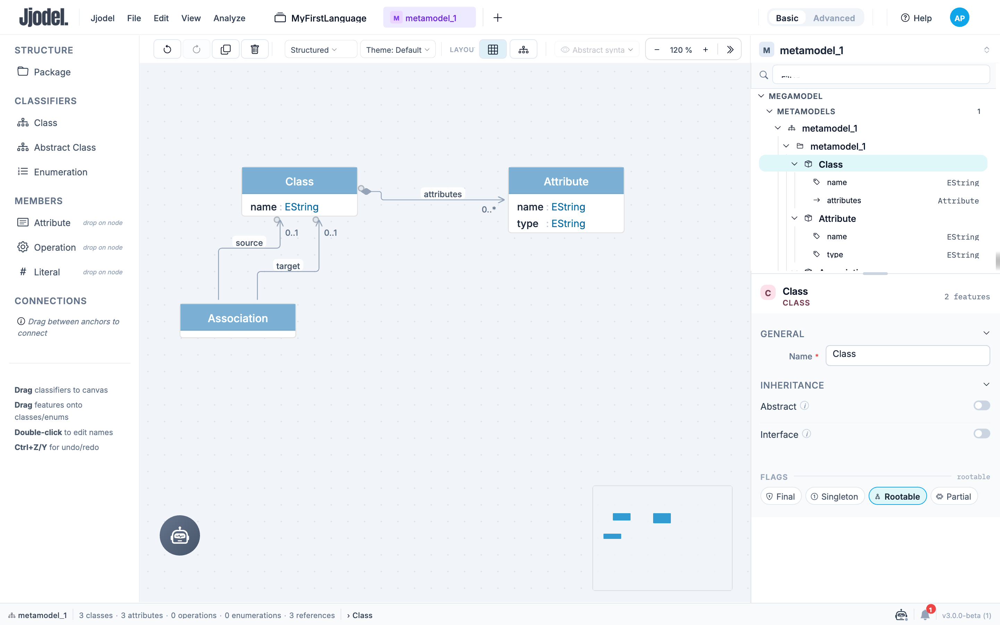
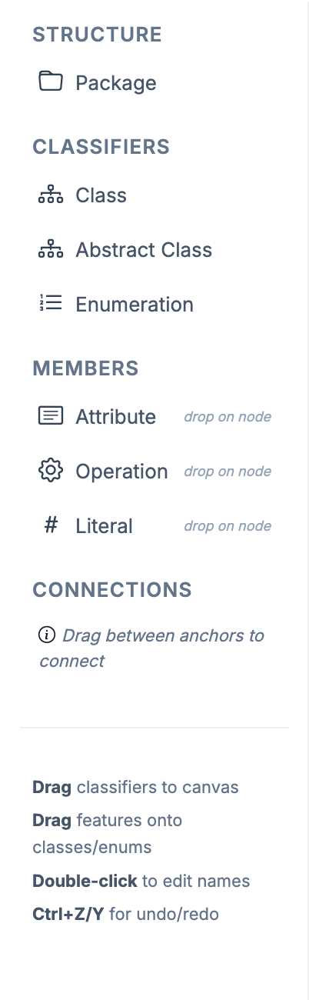
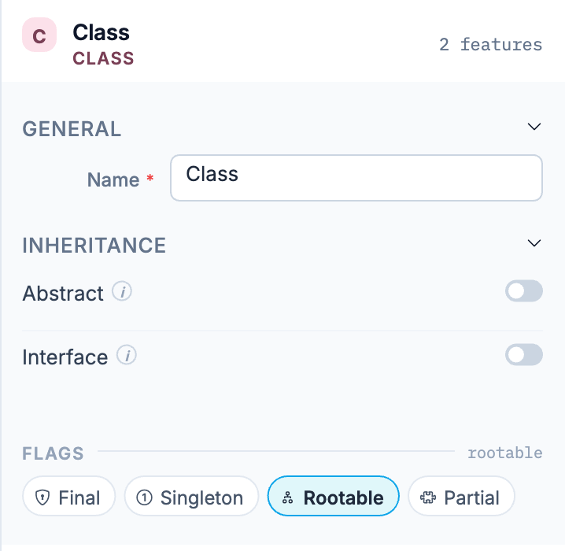
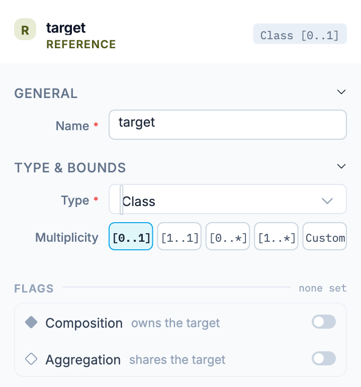
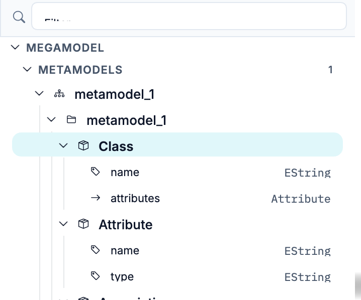

The Metamodel Editor is the core workspace for defining the **abstract syntax** of your modeling language. Here you create classes, define their attributes and operations, establish relationships (references), and set constraints that models must satisfy.

## Interface Overview

The editor is split into four areas:

- **Palette** (left) — the elements you can add, grouped into **Structure**, **Classifiers**, **Members**, and **Connections**
- **Canvas** (center) — where you arrange your metamodel, with a toolbar above it and a minimap in the bottom-right corner
- **Tree view and properties panel** (right) — the metamodel structure on top, the properties of the current selection below
- **Status bar** (bottom) — the metamodel name, its element counts, and the path of the current selection

The toolbar above the canvas holds undo and redo, duplicate and delete, a rendering-style dropdown (**Structured**, **Simplified**, **Compact**, **Wireframe**, **ER**), a theme selector, layout toggles, a viewpoint selector, and zoom controls.

The **Basic** / **Advanced** switch in the top bar controls how much detail the panels expose. Basic keeps the common properties visible; Advanced adds the rest.

## Creating Elements

Everything is created by dragging from the palette, and where you drop it decides what you get:

- **Classifiers** (**Class**, **Abstract Class**, **Enumeration**) are dragged onto the canvas
- **Members** (**Attribute**, **Operation**, **Literal**) are dropped directly onto an existing class or enumeration, as the `drop on node` hint next to each one indicates
- **Package**, under **Structure**, is dragged onto the canvas like a classifier

Double-click any name on the canvas to rename it. `Ctrl+Z` and `Ctrl+Y` undo and redo.

## Working with Classes

A class (`DClass`) is the primary building block of a metamodel. Drag **Class** from the palette onto the canvas and give it a name.

Selecting a class fills the properties panel:

- **Name** is required and must be unique within its package
- **Abstract** prevents direct instantiation; the class only serves as a base for others
- **Interface** marks the class as a contract rather than an implementation
- The **Flags** row carries four further switches: **Final** (no subclasses), **Singleton** (one instance), **Rootable** (can be a root element of a model), and **Partial** (partial definition)

**Rootable** is on by default: unless you turn it off, instances of the class can be created as top-level elements in a model.

### Inheritance

Classes support single and multiple inheritance. A child class inherits all attributes, references, and operations of its parents. See the [JjOM reference](../../reference/jjom#dclass) for the `extends` and `extendedBy` properties behind this.

## Working with Attributes

Attributes (`DAttribute`) hold intrinsic values. Drag **Attribute** from the palette's **Members** section and drop it onto a class; it appears as a row inside the class box.

Each attribute needs a name and a type. The type dropdown lists the Ecore-style primitives Jjodel ships with:

`EBoolean`, `EByte`, `EChar`, `EDate`, `EDouble`, `EFloat`, `EInt`, `ELong`, `EShort`, `EString`

You can also point an attribute at an enumeration you defined yourself. See the [Primitive Data Types](../../reference/jjom#primitive-data-types) in the JjOM reference for the full list.

## Working with References

References (`DReference`) connect classes. You can create one in two ways:

- Drag from an anchor on the source class to an anchor on the target class
- Right-click the source class and choose **Add reference**, then set its type in the properties panel

Selecting a reference, either on the canvas or in the tree, opens its properties:

- **Name** identifies the reference on the owning class
- **Type** is the target classifier
- **Multiplicity** is set with the `[0..1]`, `[1..1]`, `[0..*]`, `[1..*]` presets, or with **Custom** for other bounds
- **Composition** (*owns the target*) makes the reference a containment: contained elements belong exclusively to the parent and cannot exist on their own
- **Aggregation** (*shares the target*) marks a weaker ownership, where the target can be shared

The badge next to the reference name summarizes both at a glance, for example `Class [0..1]`.

Containment matters beyond the metamodel: in a model, instances of a contained type can only be created through their parent element.

## Working with Operations

Operations (`DOperation`) define behavior on a class. Drag **Operation** from the **Members** section onto a class, the same way you add an attribute. Operations are used for computed properties, transformations, and custom logic.

## Working with Enumerations

Enumerations define closed sets of symbolic values. Use them for attributes where only specific options are valid: cardinalities (`OneToOne`, `OneToMany`), statuses (`Active`, `Inactive`), or any domain-specific value set.

1. Drag **Enumeration** from **Classifiers** onto the canvas and name it
2. Drag **Literal** from **Members** onto the enumeration, once per value
3. To use it, set an attribute's type to the enumeration instead of a primitive

In a model, that attribute then appears as a dropdown listing the literals. Because Jjodel is reflective, adding a literal makes it immediately available in existing model instances. There is no regeneration step.

## Working with Packages

Packages (`DPackage`) group classes into namespaces. A package can contain classes or other packages, which keeps large metamodels navigable.

## Tree View

The tree view above the properties panel shows the whole project: **Metamodels** with their classes and features, plus the **Models** and **Viewpoints** built on them. Classes expand to their attributes and references, each with its type on the right.

Selecting an element in the tree selects it in the editor, and the filter box at the top narrows the tree as you type. For large metamodels this is usually faster than hunting across the canvas.

## Status Bar

The status bar reports what the metamodel contains: the number of classes, attributes, operations, enumerations, and references. It is the quickest way to confirm that an element was actually created, and the breadcrumb on its right shows the path of whatever is currently selected.
