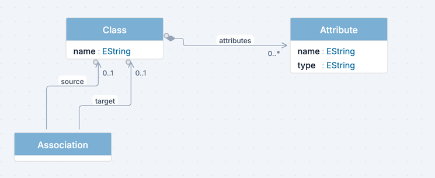

On the canvas, model elements are drawn as **nodes** and the relationships between them as **edges**. What a node looks like is not a property of the model: it comes from the active viewpoint, so the same elements can render as boxes in one viewpoint and as something else entirely in another.

## Nodes

A node is one model element drawn on the canvas. The default rendering is a rectangle with a header band carrying the name and a compartment listing the element's features, but the shape comes from a catalogue that also includes stadiums, diamonds, and ellipses.

What a node shows is decided in the [View Designer](../view-designer/):

- The **Symbol** tab picks the shape and its fill, border, padding, and sizing
- The **Structure** tab places the name and type, the accent bar, and the compartment that lists the features
- The **Form** tab describes the same element as a form, used in the properties rail and the [Data Manager](../data-manager/)

The small circles on a node's border are its **anchors**. They appear on hover and are where edges start and end.

### Interacting with Nodes

- **Click** selects the node and shows it in the properties panel
- **Double-click** a name edits it in place
- **Drag** moves the node; **snap to grid** is on by default and the toolbar can disable it
- **Right-click** opens the context menu, which is also how you add children to an element
- **Delete** or **Backspace** removes the selection, and the toolbar has **Duplicate selected** next to it

## Edges

An edge connects two nodes. Two different things can produce one:

- A **reference** in the metamodel, drawn from the element that owns it to the element it points at
- An **object rendered as a line**: a class that exists as an element in its own right but is drawn as a connection, with two of its references supplying the two ends. This is the reified association pattern, and the view declares which feature feeds the **source endpoint** and which the **target endpoint**

Containment references are drawn with a diamond at the owning end. Multiplicity appears next to each end, and the reference name sits on the line.

### Edge Appearance

An edge view configures the line itself:

- **Line style**: solid, dashed, or dotted
- **Routing**: **Manhattan**, the default, which keeps to horizontal and vertical segments; **Direct**, a straight line; or **Bezier**, a curve
- **Markers**: each end takes one of **None**, **Open arrow**, **Closed arrow**, **Hollow triangle**, **Filled diamond**, or **Hollow diamond**, so UML composition, aggregation, and inheritance ends are all expressible
- **Label**: the text carried on the line

## Canvas Controls

The toolbar above the canvas holds the controls that affect how the whole diagram is drawn:

- **Notation mode** switches the built-in rendering: **Structured**, **Simplified**, **Compact**, **Wireframe**, or **ER**
- **Color scheme** changes the palette
- **Disable snap to grid** frees node positions from the grid
- **Auto layout** rearranges the diagram
- **Zoom out**, **Reset zoom to 100%**, and **Zoom in**
- **Hide panel** takes the right rail off screen

In a metamodel editor the viewpoint selector stays disabled: metamodels are always shown in abstract syntax. It becomes available on a model, where it lists the viewpoints that apply.

:::note
Node positions and sizes belong to the viewpoint, not to the model. Two viewpoints can place the same elements differently, and neither changes the model itself.
:::
