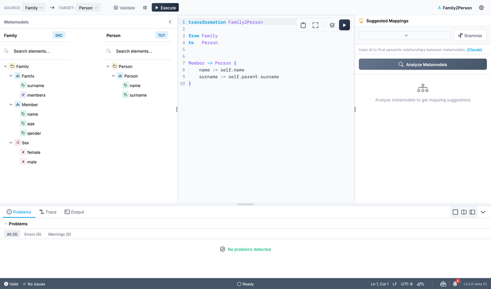
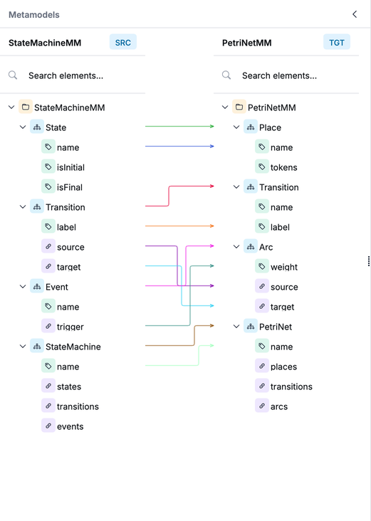
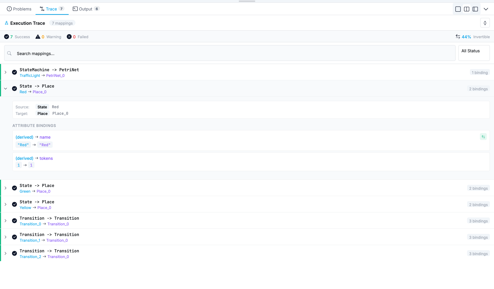

The Transformation Editor is a dedicated environment for writing and executing JjTL model-to-model transformations.

Available since Jjodel 3.0.



## Opening the editor

Transformations live under **Transforms** in the project rail and in the **Transformations** section of the project page. Click one to open its editor, or use **New transform** to start one.

## Editor layout

The editor has four areas:

- **Top bar**: the **Source** and **Target** metamodel selectors, then **Validate Transformation**, **Format Code** (`⌘+Shift+F`), **Execute Transformation** (`⌘+Enter`), and **Settings**
- **Metamodels** (left): the source and target structures side by side, each tagged **SRC** and **TGT** and each with its own search box
- **Code editor** (center): the JjTL rules, with syntax highlighting and its own copy, fullscreen, validate, and execute buttons
- **Suggested Mappings** (right): AI-assisted mapping suggestions, which need an AI provider configured in Settings (see [Mapping Suggestions](../../ai/mappings)), and a **Grammar** reference

A panel across the bottom carries three tabs, **Problems**, **Trace**, and **Output**, and the status bar below it reports whether the transformation is valid along with the cursor position and the language.

## Writing a transformation

A transformation starts with a header declaring its name and the source/target metamodels:

```jjtl
transformation MyTransformation

from SourceMetamodel
to   TargetMetamodel
```

Then add class mappings and attribute bindings. See the [JjTL Reference](../../languages/jjtl) for the full syntax.

Transformation names use letters, digits, and underscores (`Class2Table`, `uml_to_rdbms`). Hyphens are not valid in transformation names.

## Mapping view

The editor draws the correspondences declared in your rules as arrows between the source and target metamodel structures. Arrows use Manhattan routing: nearly horizontal connections render as straight lines, the others bend at right angles. This keeps dense mappings readable when several rules target the same class.

The mapping view updates as you type: adding a class mapping or an attribute binding adds the corresponding arrow.



## Validation and execution

Click **Validate** to check the transformation for syntax errors. The Problems panel at the bottom shows errors and warnings.

Click **Execute** to run the transformation. Jjodel creates a new target model containing the transformation result. The Output panel shows execution details, timing, and any warnings.

### Interactive execution

If the transformation uses `prompt` or `confirm` (see [Interactive features](../../languages/jjtl#interactive-features)), execution pauses at each call and opens a dialog. The value you enter flows into the binding being evaluated; canceling a prompt yields `null`. Combined with `let`, one answer can drive several bindings without repeated dialogs.

## Trace view

After execution, the **Trace** tab shows every mapping that was applied: which source elements produced which target elements, and whether each attribute mapping is invertible.



Use the search box to filter trace entries by class name or mapping rule.
