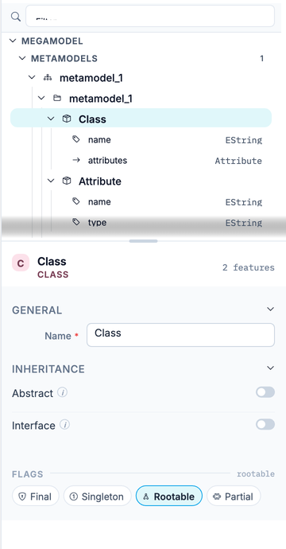
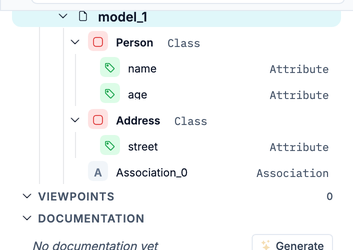

The tree view is the upper part of the right rail, above the properties panel. It shows the whole project as one hierarchy: metamodels with their classes and features, the models that conform to them, viewpoints with their views, and transformations. Selecting a row selects the same element in the editor, so the tree is the fastest way to reach something when the canvas is crowded.

## What the Tree Contains

The root is **Megamodel**. Under it:

- **Metamodels**: one node per metamodel. Packages expand to classes, classes to attributes and references, each with its type and multiplicity on the right. Abstract classes are shown in italics. Under each metamodel, a **Models** section lists the models that conform to it; a model expands to its instances, nested by containment, with singletons listed first.
- **Viewpoints**: grouped into **Syntax** and **Validation**. A viewpoint expands to its views; vertex, row, and edge views carry different icons. A viewpoint that can be stacked on others shows a stack marker.
- **Documentation**: the documentation attached to the project.
- **Transformations**: one node per JjTL transformation, expanding to its rules and helpers. The section appears only when the project has transformations.

The icon in front of each name says what kind of element it is; hover it to read the label. The expanded and collapsed state of every node is saved with the project, so the tree reopens as you left it.

## Selecting and Opening

Click a row to select it. The editor selects the same element and the properties panel shows it; clicking an instance selects it on the model canvas. The other row interactions:

- **Double-click a view** to pin the properties panel on it.
- **Click a transformation** to open it in the transformation editor.
- **Right-click a class, package, enumeration, or metamodel** in Advanced mode and choose **Create View**. This adds a view for that element to the viewpoint you edited last. The entry is disabled until you have opened a viewpoint.
- **Hover a view** to reveal **Duplicate** and **Delete**. The **+** button on a viewpoint adds a blank view and opens its name for editing.

## Filtering

The **Filter** field at the top of the pane narrows the tree as you type. Matching rows stay visible together with their ancestors, the number of matches appears next to the field, and sections with no match disappear. Clearing the field restores the expansion state you had before; nodes you collapse during a search are not saved.

## Viewpoint Scope

When the active viewpoint declares which classifiers it renders, a scope bar appears above the tree: `filter: <viewpoint> on <metamodel>`, followed by the number of classifiers the viewpoint leaves out. Those classes stay in the tree, dimmed, with their features collapsed and a **not rendered** hint. Classes of other metamodels are not dimmed, because the viewpoint has no say on them.

The bar is absent when no viewpoint is active or when the viewpoint renders every classifier.

## Row Markers

- A **warning triangle** marks an element with a validation problem. Hover it to read the message; the color follows the severity.
- A **curve marker** on a class means the active viewpoint renders it as an edge rather than a node.
- While a JjScript runs, the pane shows an **Executing** badge, and the elements the script creates get a short-lived **NEW** badge.

## Focus and Browse

Selecting an attribute, reference, operation, or enumeration literal collapses the tree pane so the properties panel gets the full height. A breadcrumb bar replaces the tree: it names the owner and the selected element, and its arrows step to the previous or next sibling (also **K** and **J**, or the arrow keys). Press **Escape** or click the owner name to bring the tree back.

## Showing, Hiding, and Resizing

- **⌘B** (Ctrl+B on Windows and Linux) hides and shows the tree pane. When the tree is hidden, a **Structure** button at the top of the rail brings it back.
- **Hide panel** in the canvas toolbar takes the whole rail off screen, tree and properties together.
- Drag the splitter between the tree and the properties panel to change their heights. Double-click it to reset.

:::tip
For a model, the [Data Manager](../data-manager) shows the same instances as a table with forms. Use it when you need to fill in many values; use the tree when you need to find one element quickly.
:::
