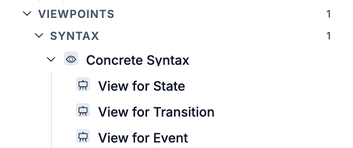
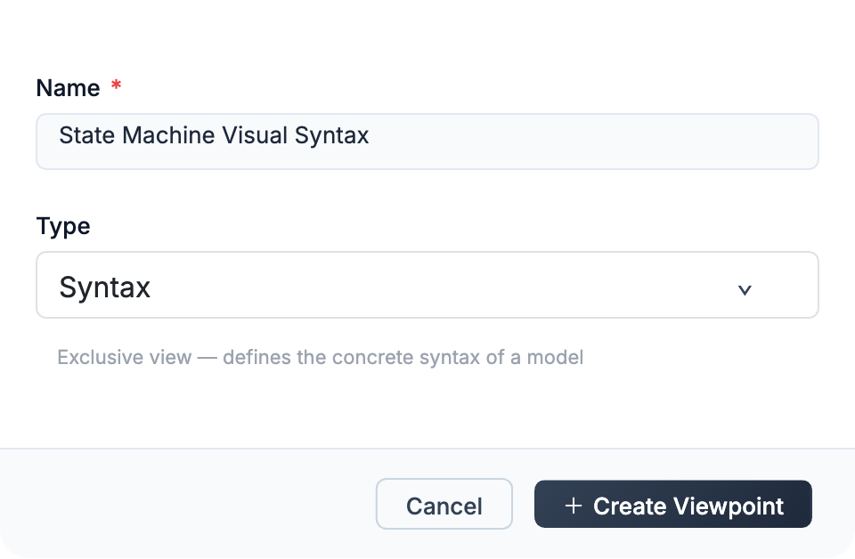
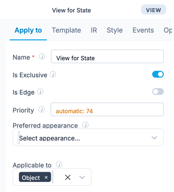

A viewpoint defines a perspective on a model. It controls how elements look, what constraints they must satisfy, and how they behave. Each viewpoint contains a set of views, and each view targets specific metaclass instances through a predicate.

Available since Jjodel 1.5. Viewpoints, views and predicates work as they did, and Jjodel 3.0 adds a declarative way to author views, documented in [View Designer](../view-designer/). What changed is the predicate itself: it is now expressed in the form of the **Applies to** tab rather than written in OCL.

:::caution[Not in the 3.0 build]
The current build renders through **Syntax** viewpoints only. Overlays (Decoration, Semantics, Editor behavior), the ECA rules behind them, and sub-views are being restored and are planned for 3.5. What follows describes how they work, so that these pages stay usable when they return. Validation no longer works through overlays and ECA rules: see [Validation](../validation/).
:::


:::note
Views are authored declaratively from the properties panel: a shape, a structure, a form. The JSX template of 1.5 is no longer interpreted, so the pages that describe it are kept as history rather than as instructions. See [View Designer](../view-designer/).
:::

## Multi-View Modeling

Complex systems require multiple perspectives. A structural perspective shows how elements relate; a behavioral perspective shows how they evolve over time; a validation perspective highlights constraint violations. Forcing all of these into a single view creates visual noise and cognitive overload.

Jjodel realizes multi-view modeling through coordinated, interrelated metamodels describing different concerns of a domain. Each viewpoint represents a distinct abstraction (structural, behavioral, validation), and the same underlying model data supports all of them. Switching viewpoints is instant; the model itself is never modified.

This design follows the principle of Separation of Concerns (SoC), as formalized in ISO/IEC/IEEE 42010:2011: viewpoints define concerns, views realize them. By letting engineers focus on one concern at a time, multi-view modeling reduces cognitive load and promotes semantic consistency.

## Viewpoints and Views

A viewpoint groups a family of **views**. Each view targets instances of a specific metaclass and determines how they appear on the canvas. The targeting mechanism is the **predicate**: a boolean expression that selects which instances the view applies to.

Each view has up to four components:

**Predicate** selects the instances this view applies to. Without a predicate, the view applies to all instances of its target metaclasses. Predicates are built in the Applies to form, described under [Predicates](#predicates).

**Structure** defines what matching instances draw: the shape of the node, where the name and the accent go, which feature rows appear, and which widgets the form uses. You describe it in the panel, and the interpreter renders it.

**Style** controls the visual appearance using SCSS. Styles are scoped to the view and can be layered with overlay viewpoints.

**Events** <span class="badge-next">3.5</span> define behavior using the ECA (Event-Condition-Action) model. An event rule fires on data changes and can update node state attributes, enabling computed properties and simulation.



## Exclusive vs Overlay Viewpoints

Viewpoints come in two kinds, and the **type** you pick when you create one decides which: **Syntax** produces an exclusive viewpoint, while **Decoration**, **Validation**, **Semantics**, and **Editor behavior** produce overlays. The creation dialog states it as you choose: Syntax is described as an exclusive view that defines the concrete syntax of a model, Decoration as an overlay that adds visual decorations to existing views.

### Exclusive viewpoints

Syntax viewpoints are typically **exclusive**: only one exclusive viewpoint can be active at a time. When you activate "State Machine Visual Syntax", the previously active exclusive viewpoint is deactivated. This makes sense for concrete syntax: you see either the Chen notation or the crow's foot notation, not both.

In the tree, syntax viewpoints sit under a **Syntax** group and the active one carries an eye icon. A **Validation** group appears only when the project contains a viewpoint of that type; a new project has none.

### Overlay viewpoints <span class="badge-next">3.5</span>

An **overlay** (non-exclusive) viewpoint adds features on top of whatever exclusive viewpoint is currently active. Multiple overlays can be active simultaneously. They extend or override existing view definitions without replacing the entire concrete syntax.

Overlays stay independent of each other, so you can leave several of them on at once.

Overlay viewpoints serve several purposes:

**Decoration**: add visual markers to existing nodes. For example, an orange outline on all State instances, or a colored badge on elements that meet certain criteria.

**Validation**: check constraints that the metamodel syntax alone cannot express, such as a state machine with exactly one Initial State. Validation viewpoints hold declarative JjEL rules rather than views, and are described in [Validation](../validation/).

**Semantics and simulation**: attach runtime behavior to model elements. For state machines, a semantics overlay tracks which state is active, lets users fire events through buttons, and highlights the active state visually. The overlay uses state attributes as observed properties and custom event actions to implement the transition system semantics.

**Editor behavior enhancement**: modify how the editor responds to user actions on specific elements.

**In-place transformations**: apply model-level changes triggered by events.

### How overlays compose

When an overlay viewpoint defines a view for the same metaclass as the active exclusive viewpoint, the overlay's definitions layer on top. If the overlay provides only a style (no template), the exclusive viewpoint's template remains and the overlay's style is applied on top. If the overlay provides a template, it overrides the exclusive viewpoint's template for that metaclass.

## Creating a Viewpoint

To create a new viewpoint, open the project page and click **+ New** in the **Viewpoints** section, or **New viewpoint** in the project rail on the left. The **New Viewpoint** dialog asks for two things:

- **Name**, for example `Colored Viewpoint`
- **Type**: **Syntax**, **Decoration**, **Validation**, **Semantics**, or **Editor behavior**

The type is what makes the viewpoint exclusive or an overlay, and the dialog spells out which one you are about to get. Click **Create Viewpoint** to confirm.



The new viewpoint appears under **Viewpoints** in the tree, ready for its first view. To activate a viewpoint, select it. Activating an exclusive viewpoint deactivates the one that was active before; overlays toggle on and off independently.

Each view inside a viewpoint carries its own **Is Exclusive** toggle in the **Apply to** tab, which decides whether that view wins over other views matching the same instance.

## Decoration Overlays

A decoration overlay modifies the visual appearance of elements without replacing their template. The typical workflow:

1. Create a new viewpoint with **Is Exclusive unchecked**
2. Add a view targeting the metaclass you want to decorate (e.g., `State`)
3. Leave the template empty (or remove it)
4. Define only the **style**, for example:

```scss title="Style (SCSS)"
&>.root {
    outline: 4px solid orange;
}
```

5. Activate the overlay

The result: all State instances show an orange outline on top of whatever concrete syntax the active exclusive viewpoint defines. Initial State and Final State (which inherit from State) are also affected.

### View component requirements for decoration

| View Component | Required | Optional | Not Applicable |
|----------------|----------|----------|----------------|
| Predicate      |          | Y        |                |
| Template       | Y        |          |                |
| Observed Properties |     | Y        |                |
| Style          | Y        |          |                |
| Event rule (ECA) |        | Y        |                |

The template is listed as required because the overlay must know the structural context, but in practice you can leave it empty to inherit the exclusive viewpoint's template. The style is where the decoration happens.

## Validation Viewpoints <span class="badge-next">3.5</span>

A validation viewpoint holds rules, not views. Each rule is a JjEL invariant on a metamodel class with its own message, and a model is checked against the active rules on demand. The 1.5 approach, a validation overlay whose views carried `onDataUpdate` rules writing error keys into `node.state`, and the **Default Validation** overlay that earlier builds seeded, have been removed. See [Validation](../validation/).

## Views in Detail

This section describes what a view carries. The JSX template and the SCSS block of 1.5, described further down, are no longer interpreted: they are documented because older projects still contain them, not as a way to author a view today. For the current path see [View Designer](../view-designer/).

Selecting a view opens its editor in the properties panel. The **Apply to** tab carries the settings that decide when the view fires, and the remaining tabs hold the components described below.



### Predicates

A predicate decides which instances a view applies to, on top of the metaclasses the view targets. In 3.0 you build it in the **Applies to** tab of the [View Designer](../view-designer/): you pick a feature, an operator and a value, and combine the tests with and, or and not. The available tests are the comparisons (equal, not equal, and the four orderings), whether a feature is set or empty, and whether an element is of a given class. The result is stored as a structure, not as a string of code.

OCL selection was dropped in 3.0. Views written for 1.5 carry their OCL condition in the record, and JavaScript conditions live in the same place, but neither is how a predicate is written today.

Predicates define the **syntactic mapping** (σ) between abstract and concrete syntax. Each view's predicate selects a subset of model instances and maps them to their visual representation through the view's template and style. This is how the language tuple L = (A, C, S, σ, ⟦·⟧) is realized in practice.

### Structure and appearance

What a view draws is a record: the shape of the node, the header, the compartment of feature rows, the form widgets, and the colors each of them uses. You build it in the panel and the interpreter renders it, so there is no template to write and no stylesheet to keep in sync. [View Designer](../view-designer/) documents every field.

A metaclass whose instances should appear only as a connection, a Transition between two states for example, is drawn by a view whose kind is **edge**. In 1.5 the same result needed a template plus a style that collapsed the node to zero size; that trick is no longer necessary.

### The 1.5 template path

Views authored before 3.0 carry a JSX template in `jsxString` and an SCSS block beside it. Jjodel no longer interprets them: an old project opens, and its views need to be described again in the panel. The fields survive in the record, which is why they still appear in the [JjOM API](../../reference/jjom-api).

The template renders an `<Edge>` component conditionally, only when the required reference (e.g., `nextState`) is set:

```jsx title="Template for Transition Edge"
<div className={'root'}>
    {data.$nextState.value &&
        <Edge
            view={'EdgeAssociation'}
            key={data.id + '_edge'}
            start={data.parent.parent.node}
            end={data.$nextState.value.node}
            label={data.$event && data.$event.value && data.$event.value.name}
        />
    }
    {decorators}
</div>
```

The `start` property navigates from the Transition instance to its parent State (via `data.parent`) and then to the State's parent container, accessing the node submodel. The `end` property navigates to the target State's node. The `label` shows the associated event's name if one exists.

Silent views are the mechanism behind all arrow-based notations in Jjodel: ER relationships, UML associations, state machine transitions, and any other edge between two node-rendered elements.

### Events (ECA)

See [Jjodel Events](../../reference/jjodel-events) for the full ECA model. In viewpoint context, the most common event is `onDataUpdate`, which fires whenever the model data changes and lets you update `node.state` with computed results.

## Default Viewpoints

Every metamodel starts with one built-in viewpoint. **Default** is an exclusive syntax viewpoint that provides a generic rendering for all metaclass instances. It shows each instance as a labeled box with its attributes. This is the fallback when no custom syntax viewpoint is active. The **Default Validation** overlay that earlier builds added next to it is no longer seeded; the checks it carried are part of conformance.

When you create a custom exclusive viewpoint (e.g., "State Machine Visual Syntax"), it takes precedence over the Default viewpoint. Any metaclass not covered by a view in the custom viewpoint falls back to the Default viewpoint's rendering.

:::note[Default views are read-only in normal mode]
The views that belong to built-in default viewpoints (including **Default → Model**) are **read-only** in normal mode and cannot be edited directly. Two workflows are available:

- **Recommended (clone-and-own):** Create a new custom viewpoint and add your own views there. This keeps the defaults intact and is the standard approach for building notation layers and simulation overlays.
- **Debug Mode:** Enable Debug Mode from the workbench settings to unlock editing of default views. Use this only for quick experimentation; changes made this way are not preserved across sessions in the same way as custom viewpoints.
:::

## Panel and Control Components <span class="badge-next">3.5</span>

The Model view in a **custom viewpoint** supports two special components for adding interactive panels to the canvas. These components are not available in the read-only default views; add them in a custom overlay or syntax viewpoint. Both are JSX template components, which the current build does not interpret.

### Panel

`<Panel>` creates a floating titled panel with custom content. Panels appear on the canvas alongside the model elements. Common uses: simulation controls, legend, model statistics.

```jsx title="Simulation Panel Template"
<Panel title={'State Machine Simulation'}>
    <div className={'panel_content'}>
        <button onClick={resetStateMachine}>Reset</button>
        {data.allSubObjects.filter(o => o.instanceof.name === 'Event').map(e =>
            <button>{e.name}</button>
        )}
    </div>
</Panel>
```

This example creates a simulation panel with a Reset button and one button for each Event instance in the model. The buttons are generated dynamically by querying `data.allSubObjects`.

### Control

`<Control>` adds workbench-level controls that affect the editor behavior. Controls appear in a collapsible section and expose parameters like zoom level, grid, and snap.

```jsx title="Workbench Control Template"
<Control title={'Workbench'} payoff={'Options'}>
    <Slider name={'level'} title={'Detail level '} node={node} max={3} />
    <Toggle name={'grid'} title={'Grid'} node={node} />
    <Toggle name={'snap'} title={'Snap'} node={node} />
</Control>
```

`<Slider>` creates a numeric slider bound to a node property. `<Toggle>` creates an on/off switch. Both write their values to the node, making them available to templates and ECA rules.

:::caution
Viewpoints are part of the notation definition, not the model data. Modifying a viewpoint changes the visualization, not the model structure. Deleting a viewpoint does not delete any model elements.
:::
